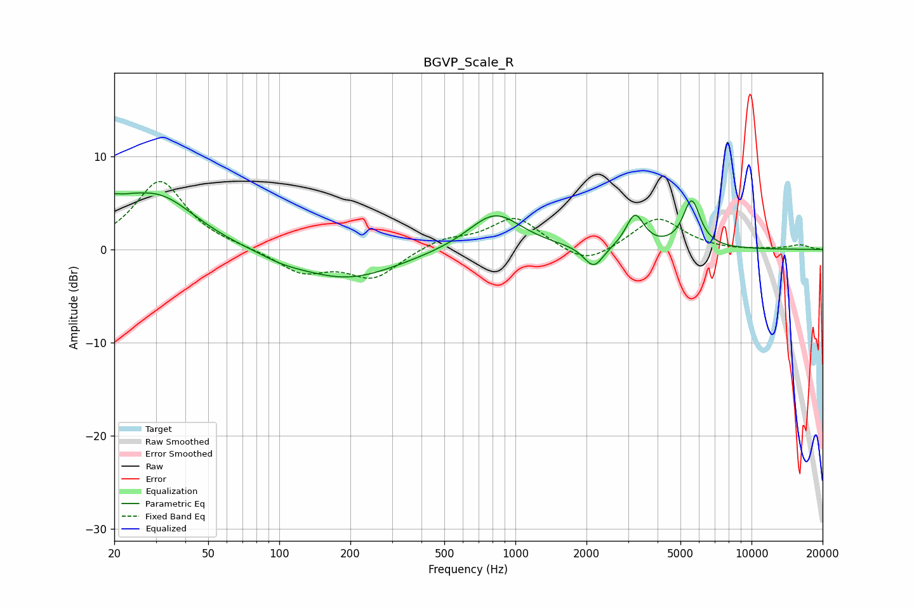

# BGVP_Scale_R
See [usage instructions](https://github.com/jaakkopasanen/AutoEq#usage) for more options and info.

### Parametric EQs
Apply preamp of -6.2 dB when using parametric equalizer.

|   # | Type    |   Fc (Hz) |    Q |   Gain (dB) |
|-----|---------|-----------|------|-------------|
|   1 | Peaking |        20 | 5.62 |         3.4 |
|   2 | Peaking |        20 | 5.77 |        -2.4 |
|   3 | Peaking |        21 | 1.6  |         2   |
|   4 | Peaking |        31 | 0.89 |         5.3 |
|   5 | Peaking |       102 | 1.54 |        -0.5 |
|   6 | Peaking |       193 | 0.65 |        -3.2 |
|   7 | Peaking |       818 | 1.26 |         4   |
|   8 | Peaking |      2146 | 3.39 |        -2.4 |
|   9 | Peaking |      3211 | 3.75 |         3.6 |
|  10 | Peaking |      5576 | 3.84 |         5.1 |

### Fixed Band EQs
When using fixed band (also called graphic) equalizer, apply preamp of **-7.4 dB** (if available) and set gains manually with these parameters.

|   # | Type    |   Fc (Hz) |    Q |   Gain (dB) |
|-----|---------|-----------|------|-------------|
|   1 | Peaking |        31 | 1.41 |         7.4 |
|   2 | Peaking |        62 | 1.41 |         0.1 |
|   3 | Peaking |       125 | 1.41 |        -2.4 |
|   4 | Peaking |       250 | 1.41 |        -3   |
|   5 | Peaking |       500 | 1.41 |         1.1 |
|   6 | Peaking |      1000 | 1.41 |         3.4 |
|   7 | Peaking |      2000 | 1.41 |        -1.9 |
|   8 | Peaking |      4000 | 1.41 |         3.5 |
|   9 | Peaking |      8000 | 1.41 |        -0.1 |
|  10 | Peaking |     16000 | 1.41 |         0.5 |

### Graphs

