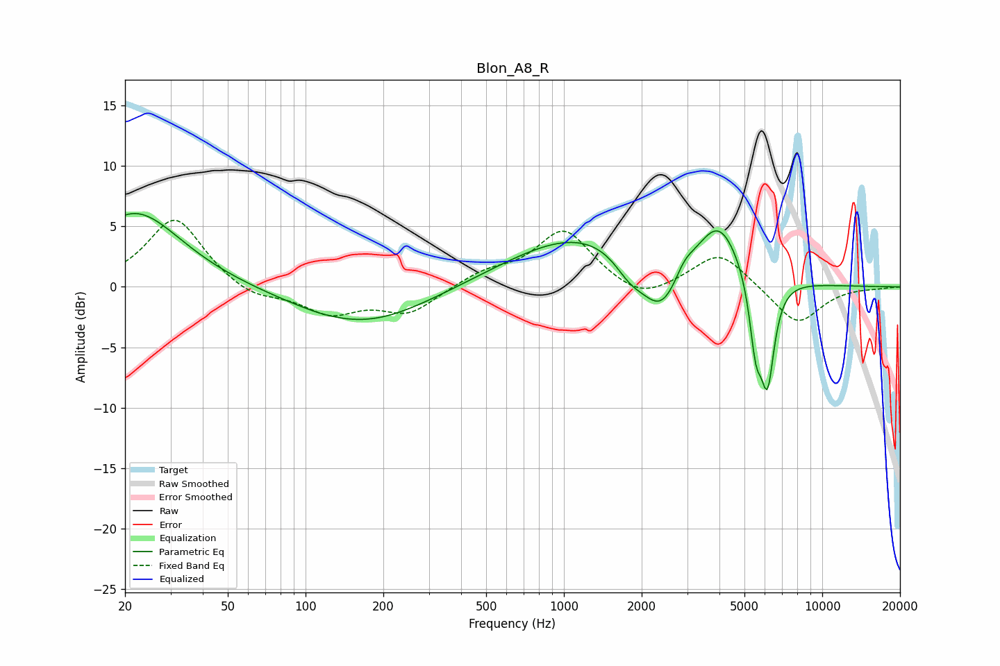

# Blon_A8_R
See [usage instructions](https://github.com/jaakkopasanen/AutoEq#usage) for more options and info.

### Parametric EQs
Apply preamp of -6.2 dB when using parametric equalizer.

|   # | Type    |   Fc (Hz) |    Q |   Gain (dB) |
|-----|---------|-----------|------|-------------|
|   1 | Peaking |        22 | 0.8  |         6.2 |
|   2 | Peaking |       110 | 3    |        -0   |
|   3 | Peaking |       166 | 0.55 |        -3.2 |
|   4 | Peaking |      1228 | 0.48 |         4.6 |
|   5 | Peaking |      1800 | 2.28 |        -1.7 |
|   6 | Peaking |      2385 | 1.74 |        -4.8 |
|   7 | Peaking |      2926 | 3.8  |         1.1 |
|   8 | Peaking |      3971 | 1.64 |         4.8 |
|   9 | Peaking |      5529 | 5.69 |        -5.3 |
|  10 | Peaking |      6139 | 4.98 |        -8.3 |

### Fixed Band EQs
When using fixed band (also called graphic) equalizer, apply preamp of **-5.6 dB** (if available) and set gains manually with these parameters.

|   # | Type    |   Fc (Hz) |    Q |   Gain (dB) |
|-----|---------|-----------|------|-------------|
|   1 | Peaking |        31 | 1.41 |         5.8 |
|   2 | Peaking |        62 | 1.41 |        -1.1 |
|   3 | Peaking |       125 | 1.41 |        -2.1 |
|   4 | Peaking |       250 | 1.41 |        -2.1 |
|   5 | Peaking |       500 | 1.41 |         1.1 |
|   6 | Peaking |      1000 | 1.41 |         4.7 |
|   7 | Peaking |      2000 | 1.41 |        -1.4 |
|   8 | Peaking |      4000 | 1.41 |         3   |
|   9 | Peaking |      8000 | 1.41 |        -3.2 |
|  10 | Peaking |     16000 | 1.41 |        -0.1 |

### Graphs

