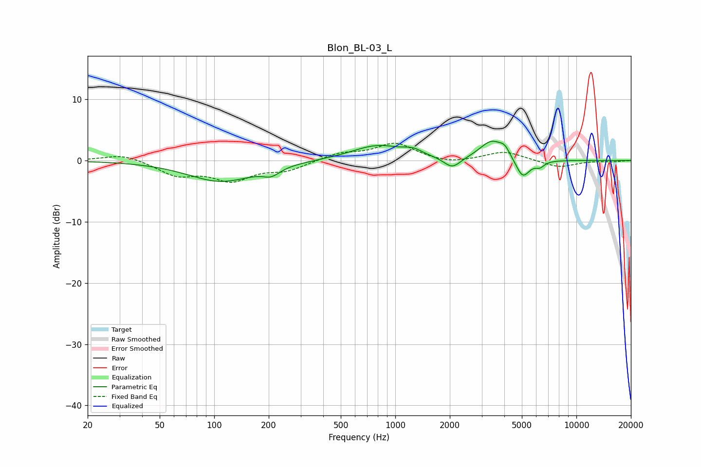

# Blon_BL-03_L
See [usage instructions](https://github.com/jaakkopasanen/AutoEq#usage) for more options and info.

### Parametric EQs
Apply preamp of -3.2 dB when using parametric equalizer.

|   # | Type    |   Fc (Hz) |    Q |   Gain (dB) |
|-----|---------|-----------|------|-------------|
|   1 | Peaking |       109 | 0.77 |        -3.4 |
|   2 | Peaking |       207 | 3.02 |        -1.2 |
|   3 | Peaking |       631 | 1.08 |        -0.2 |
|   4 | Peaking |       788 | 0.95 |         2.6 |
|   5 | Peaking |      1252 | 2.86 |         0.8 |
|   6 | Peaking |      2064 | 3.01 |        -1.9 |
|   7 | Peaking |      3400 | 2.16 |         3.1 |
|   8 | Peaking |      4021 | 4.82 |         1.3 |
|   9 | Peaking |      5053 | 3.67 |        -3.2 |
|  10 | Peaking |      6284 | 5.49 |        -0.9 |

### Fixed Band EQs
When using fixed band (also called graphic) equalizer, apply preamp of **-2.9 dB** (if available) and set gains manually with these parameters.

|   # | Type    |   Fc (Hz) |    Q |   Gain (dB) |
|-----|---------|-----------|------|-------------|
|   1 | Peaking |        31 | 1.41 |         1.1 |
|   2 | Peaking |        62 | 1.41 |        -2.3 |
|   3 | Peaking |       125 | 1.41 |        -3   |
|   4 | Peaking |       250 | 1.41 |        -1.5 |
|   5 | Peaking |       500 | 1.41 |         1.1 |
|   6 | Peaking |      1000 | 1.41 |         2.8 |
|   7 | Peaking |      2000 | 1.41 |        -0.6 |
|   8 | Peaking |      4000 | 1.41 |         1.5 |
|   9 | Peaking |      8000 | 1.41 |        -1.2 |
|  10 | Peaking |     16000 | 1.41 |        -0.2 |

### Graphs

