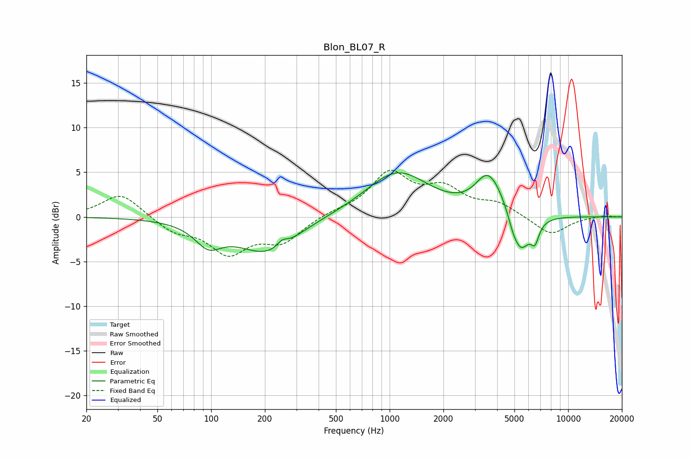

# Blon_BL07_R
See [usage instructions](https://github.com/jaakkopasanen/AutoEq#usage) for more options and info.

### Parametric EQs
Apply preamp of -5.0 dB when using parametric equalizer.

|   # | Type    |   Fc (Hz) |    Q |   Gain (dB) |
|-----|---------|-----------|------|-------------|
|   1 | Peaking |        96 | 1.92 |        -2.3 |
|   2 | Peaking |       214 | 0.79 |        -4.4 |
|   3 | Peaking |       250 | 4.77 |         0.8 |
|   4 | Peaking |       309 | 0.87 |         0.6 |
|   5 | Peaking |      1104 | 0.8  |         5   |
|   6 | Peaking |      3518 | 2.03 |         3.6 |
|   7 | Peaking |      4096 | 1.97 |         1.3 |
|   8 | Peaking |      4898 | 5.76 |        -0.6 |
|   9 | Peaking |      5407 | 2.6  |        -4.5 |
|  10 | Peaking |      6518 | 5.98 |        -2   |

### Fixed Band EQs
When using fixed band (also called graphic) equalizer, apply preamp of **-5.3 dB** (if available) and set gains manually with these parameters.

|   # | Type    |   Fc (Hz) |    Q |   Gain (dB) |
|-----|---------|-----------|------|-------------|
|   1 | Peaking |        31 | 1.41 |         2.7 |
|   2 | Peaking |        62 | 1.41 |        -1.5 |
|   3 | Peaking |       125 | 1.41 |        -3.8 |
|   4 | Peaking |       250 | 1.41 |        -2.6 |
|   5 | Peaking |       500 | 1.41 |         0.5 |
|   6 | Peaking |      1000 | 1.41 |         4.7 |
|   7 | Peaking |      2000 | 1.41 |         2.8 |
|   8 | Peaking |      4000 | 1.41 |         1.4 |
|   9 | Peaking |      8000 | 1.41 |        -2.1 |
|  10 | Peaking |     16000 | 1.41 |         0.2 |

### Graphs

