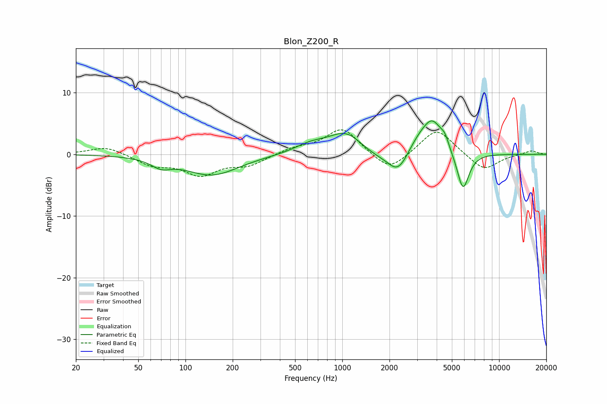

# Blon_Z200_R
See [usage instructions](https://github.com/jaakkopasanen/AutoEq#usage) for more options and info.

### Parametric EQs
Apply preamp of -5.5 dB when using parametric equalizer.

|   # | Type    |   Fc (Hz) |    Q |   Gain (dB) |
|-----|---------|-----------|------|-------------|
|   1 | Peaking |        70 | 2.26 |        -1.3 |
|   2 | Peaking |       147 | 0.83 |        -3.3 |
|   3 | Peaking |       625 | 1.38 |         1.3 |
|   4 | Peaking |      1061 | 1.26 |         3.6 |
|   5 | Peaking |      1557 | 1.31 |        -1   |
|   6 | Peaking |      2272 | 2.09 |        -3.7 |
|   7 | Peaking |      3056 | 1.84 |         2   |
|   8 | Peaking |      3766 | 2.12 |         5   |
|   9 | Peaking |      4506 | 5.72 |         1.3 |
|  10 | Peaking |      5883 | 3.55 |        -6.4 |

### Fixed Band EQs
When using fixed band (also called graphic) equalizer, apply preamp of **-4.1 dB** (if available) and set gains manually with these parameters.

|   # | Type    |   Fc (Hz) |    Q |   Gain (dB) |
|-----|---------|-----------|------|-------------|
|   1 | Peaking |        31 | 1.41 |         1.3 |
|   2 | Peaking |        62 | 1.41 |        -1.7 |
|   3 | Peaking |       125 | 1.41 |        -3.1 |
|   4 | Peaking |       250 | 1.41 |        -1.6 |
|   5 | Peaking |       500 | 1.41 |         0.9 |
|   6 | Peaking |      1000 | 1.41 |         4.3 |
|   7 | Peaking |      2000 | 1.41 |        -3.1 |
|   8 | Peaking |      4000 | 1.41 |         4.3 |
|   9 | Peaking |      8000 | 1.41 |        -2.7 |
|  10 | Peaking |     16000 | 1.41 |         0.6 |

### Graphs

