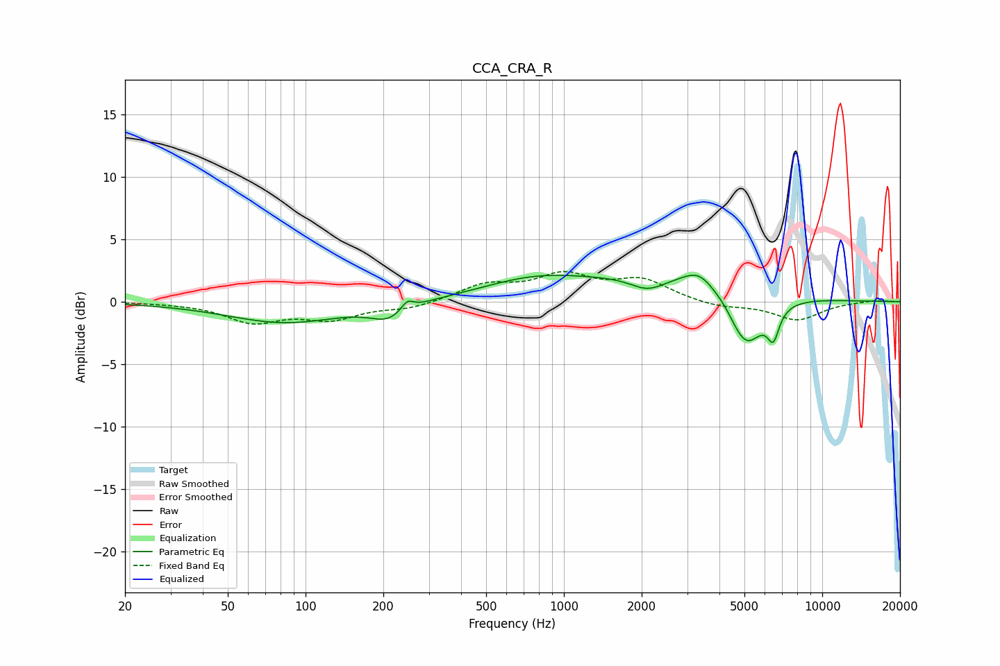

# CCA_CRA_R
See [usage instructions](https://github.com/jaakkopasanen/AutoEq#usage) for more options and info.

### Parametric EQs
Apply preamp of -2.2 dB when using parametric equalizer.

|   # | Type    |   Fc (Hz) |    Q |   Gain (dB) |
|-----|---------|-----------|------|-------------|
|   1 | Peaking |        83 | 0.63 |        -1.7 |
|   2 | Peaking |       209 | 2.09 |        -1.2 |
|   3 | Peaking |       247 | 6    |         0.8 |
|   4 | Peaking |       769 | 0.67 |         1.6 |
|   5 | Peaking |      2117 | 1.98 |        -1.2 |
|   6 | Peaking |      2776 | 0.5  |         2.2 |
|   7 | Peaking |      3324 | 2.61 |         1.1 |
|   8 | Peaking |      4273 | 2.34 |         0.5 |
|   9 | Peaking |      5034 | 1.95 |        -4.8 |
|  10 | Peaking |      6466 | 6    |        -2.3 |

### Fixed Band EQs
When using fixed band (also called graphic) equalizer, apply preamp of **-2.5 dB** (if available) and set gains manually with these parameters.

|   # | Type    |   Fc (Hz) |    Q |   Gain (dB) |
|-----|---------|-----------|------|-------------|
|   1 | Peaking |        31 | 1.41 |        -0   |
|   2 | Peaking |        62 | 1.41 |        -1.5 |
|   3 | Peaking |       125 | 1.41 |        -1.3 |
|   4 | Peaking |       250 | 1.41 |        -0.5 |
|   5 | Peaking |       500 | 1.41 |         1.3 |
|   6 | Peaking |      1000 | 1.41 |         1.9 |
|   7 | Peaking |      2000 | 1.41 |         1.6 |
|   8 | Peaking |      4000 | 1.41 |        -0.5 |
|   9 | Peaking |      8000 | 1.41 |        -1.5 |
|  10 | Peaking |     16000 | 1.41 |         0.1 |

### Graphs

