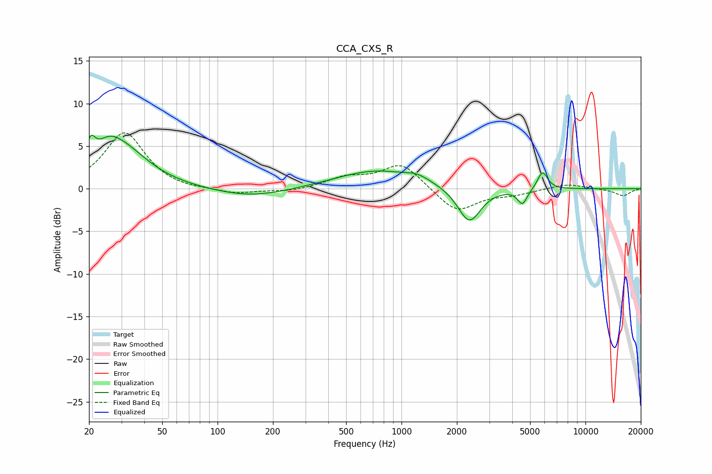

# CCA_CXS_R
See [usage instructions](https://github.com/jaakkopasanen/AutoEq#usage) for more options and info.

### Parametric EQs
Apply preamp of -6.4 dB when using parametric equalizer.

|   # | Type    |   Fc (Hz) |    Q |   Gain (dB) |
|-----|---------|-----------|------|-------------|
|   1 | Peaking |        20 | 5.68 |         2.5 |
|   2 | Peaking |        25 | 2.26 |         1.6 |
|   3 | Peaking |        30 | 0.97 |         4.7 |
|   4 | Peaking |       152 | 0.7  |        -1.1 |
|   5 | Peaking |       729 | 0.64 |         2.2 |
|   6 | Peaking |      1236 | 2.34 |         0.7 |
|   7 | Peaking |      1283 | 4.26 |        -0.1 |
|   8 | Peaking |      2336 | 2.28 |        -4.2 |
|   9 | Peaking |      4545 | 5.36 |        -1.8 |
|  10 | Peaking |      5842 | 5.04 |         2.1 |

### Fixed Band EQs
When using fixed band (also called graphic) equalizer, apply preamp of **-6.6 dB** (if available) and set gains manually with these parameters.

|   # | Type    |   Fc (Hz) |    Q |   Gain (dB) |
|-----|---------|-----------|------|-------------|
|   1 | Peaking |        31 | 1.41 |         6.6 |
|   2 | Peaking |        62 | 1.41 |        -0.3 |
|   3 | Peaking |       125 | 1.41 |        -0.6 |
|   4 | Peaking |       250 | 1.41 |        -0.4 |
|   5 | Peaking |       500 | 1.41 |         1.2 |
|   6 | Peaking |      1000 | 1.41 |         3   |
|   7 | Peaking |      2000 | 1.41 |        -2.8 |
|   8 | Peaking |      4000 | 1.41 |        -0.6 |
|   9 | Peaking |      8000 | 1.41 |         0.6 |
|  10 | Peaking |     16000 | 1.41 |        -0.8 |

### Graphs

