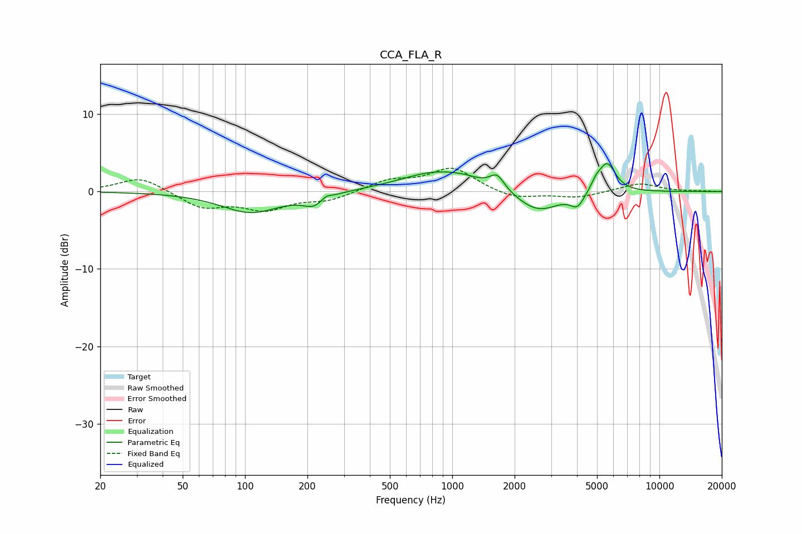

# CCA_FLA_R
See [usage instructions](https://github.com/jaakkopasanen/AutoEq#usage) for more options and info.

### Parametric EQs
Apply preamp of -3.7 dB when using parametric equalizer.

|   # | Type    |   Fc (Hz) |    Q |   Gain (dB) |
|-----|---------|-----------|------|-------------|
|   1 | Peaking |       107 | 0.98 |        -2.7 |
|   2 | Peaking |       215 | 2.69 |        -1.4 |
|   3 | Peaking |       246 | 6    |         0.5 |
|   4 | Peaking |       864 | 0.79 |         2.6 |
|   5 | Peaking |      1161 | 2.46 |         0.3 |
|   6 | Peaking |      1644 | 4.01 |         1.9 |
|   7 | Peaking |      2597 | 1.34 |        -2.8 |
|   8 | Peaking |      4017 | 4.28 |        -1.7 |
|   9 | Peaking |      4947 | 6    |         0.9 |
|  10 | Peaking |      5589 | 3.34 |         3.8 |

### Fixed Band EQs
When using fixed band (also called graphic) equalizer, apply preamp of **-3.1 dB** (if available) and set gains manually with these parameters.

|   # | Type    |   Fc (Hz) |    Q |   Gain (dB) |
|-----|---------|-----------|------|-------------|
|   1 | Peaking |        31 | 1.41 |         1.9 |
|   2 | Peaking |        62 | 1.41 |        -2   |
|   3 | Peaking |       125 | 1.41 |        -2.1 |
|   4 | Peaking |       250 | 1.41 |        -1.1 |
|   5 | Peaking |       500 | 1.41 |         1.4 |
|   6 | Peaking |      1000 | 1.41 |         3   |
|   7 | Peaking |      2000 | 1.41 |        -1   |
|   8 | Peaking |      4000 | 1.41 |        -0.8 |
|   9 | Peaking |      8000 | 1.41 |         1.1 |
|  10 | Peaking |     16000 | 1.41 |         0.1 |

### Graphs

