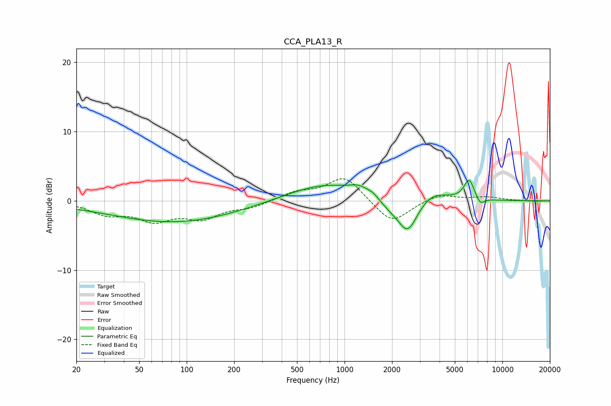

# CCA_PLA13_R
See [usage instructions](https://github.com/jaakkopasanen/AutoEq#usage) for more options and info.

### Parametric EQs
Apply preamp of -3.0 dB when using parametric equalizer.

|   # | Type    |   Fc (Hz) |    Q |   Gain (dB) |
|-----|---------|-----------|------|-------------|
|   1 | Peaking |        25 | 0.27 |        -0.4 |
|   2 | Peaking |        88 | 0.36 |        -2.9 |
|   3 | Peaking |       750 | 0.6  |         2.5 |
|   4 | Peaking |      1241 | 2.39 |         1   |
|   5 | Peaking |      1518 | 3.73 |         0.5 |
|   6 | Peaking |      1941 | 1.81 |        -1.2 |
|   7 | Peaking |      2517 | 2.29 |        -4.7 |
|   8 | Peaking |      3635 | 1.54 |         1.4 |
|   9 | Peaking |      6159 | 4.17 |         3   |
|  10 | Peaking |      7231 | 5.21 |        -1.1 |

### Fixed Band EQs
When using fixed band (also called graphic) equalizer, apply preamp of **-3.3 dB** (if available) and set gains manually with these parameters.

|   # | Type    |   Fc (Hz) |    Q |   Gain (dB) |
|-----|---------|-----------|------|-------------|
|   1 | Peaking |        31 | 1.41 |        -1.7 |
|   2 | Peaking |        62 | 1.41 |        -2.5 |
|   3 | Peaking |       125 | 1.41 |        -2.3 |
|   4 | Peaking |       250 | 1.41 |        -0.9 |
|   5 | Peaking |       500 | 1.41 |         1.2 |
|   6 | Peaking |      1000 | 1.41 |         3.6 |
|   7 | Peaking |      2000 | 1.41 |        -3.4 |
|   8 | Peaking |      4000 | 1.41 |         1   |
|   9 | Peaking |      8000 | 1.41 |         0.5 |
|  10 | Peaking |     16000 | 1.41 |        -0.1 |

### Graphs

