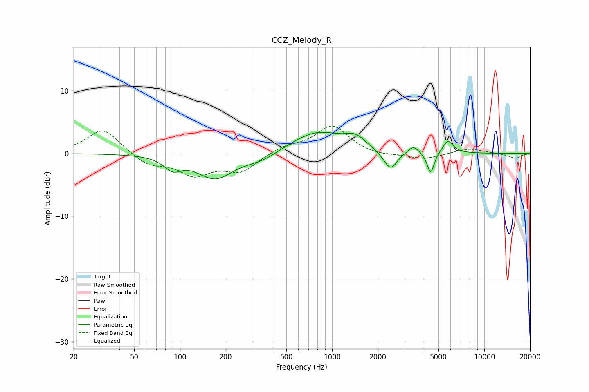

# CCZ_Melody_R
See [usage instructions](https://github.com/jaakkopasanen/AutoEq#usage) for more options and info.

### Parametric EQs
Apply preamp of -3.5 dB when using parametric equalizer.

|   # | Type    |   Fc (Hz) |    Q |   Gain (dB) |
|-----|---------|-----------|------|-------------|
|   1 | Peaking |        89 | 2.56 |        -1.9 |
|   2 | Peaking |       170 | 1.18 |        -3.9 |
|   3 | Peaking |       346 | 1.2  |        -1.3 |
|   4 | Peaking |       796 | 0.78 |         3.5 |
|   5 | Peaking |      1424 | 2.19 |         1.6 |
|   6 | Peaking |      2220 | 2.65 |        -0.5 |
|   7 | Peaking |      2432 | 3.37 |        -2.7 |
|   8 | Peaking |      3423 | 4.15 |         1.2 |
|   9 | Peaking |      4442 | 5.99 |        -3.5 |
|  10 | Peaking |      5767 | 3.98 |         2.1 |

### Fixed Band EQs
When using fixed band (also called graphic) equalizer, apply preamp of **-4.5 dB** (if available) and set gains manually with these parameters.

|   # | Type    |   Fc (Hz) |    Q |   Gain (dB) |
|-----|---------|-----------|------|-------------|
|   1 | Peaking |        31 | 1.41 |         4   |
|   2 | Peaking |        62 | 1.41 |        -1.8 |
|   3 | Peaking |       125 | 1.41 |        -3.2 |
|   4 | Peaking |       250 | 1.41 |        -2.7 |
|   5 | Peaking |       500 | 1.41 |         1.1 |
|   6 | Peaking |      1000 | 1.41 |         4.4 |
|   7 | Peaking |      2000 | 1.41 |        -0.5 |
|   8 | Peaking |      4000 | 1.41 |        -0.9 |
|   9 | Peaking |      8000 | 1.41 |         0.8 |
|  10 | Peaking |     16000 | 1.41 |        -0.8 |

### Graphs

