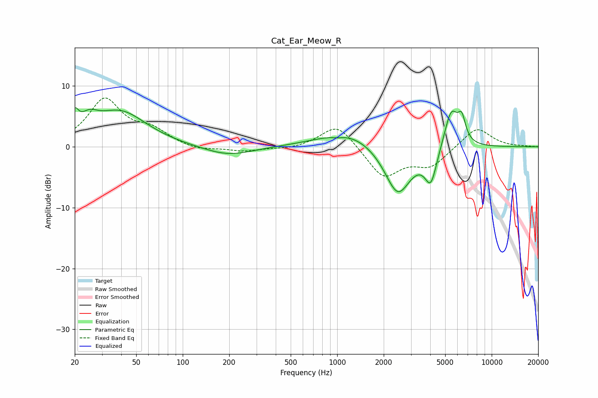

# Cat_Ear_Meow_R
See [usage instructions](https://github.com/jaakkopasanen/AutoEq#usage) for more options and info.

### Parametric EQs
Apply preamp of -6.5 dB when using parametric equalizer.

|   # | Type    |   Fc (Hz) |    Q |   Gain (dB) |
|-----|---------|-----------|------|-------------|
|   1 | Peaking |        20 | 5.94 |         3   |
|   2 | Peaking |        25 | 2.49 |         2.3 |
|   3 | Peaking |        39 | 0.82 |         5.7 |
|   4 | Peaking |       196 | 0.89 |        -1.6 |
|   5 | Peaking |      1003 | 3.78 |        -0.3 |
|   6 | Peaking |      1197 | 0.73 |         2.7 |
|   7 | Peaking |      2467 | 1.6  |        -8.4 |
|   8 | Peaking |      4039 | 3.59 |        -5.5 |
|   9 | Peaking |      5476 | 2.95 |         6.5 |
|  10 | Peaking |      6404 | 5.7  |         3.4 |

### Fixed Band EQs
When using fixed band (also called graphic) equalizer, apply preamp of **-8.1 dB** (if available) and set gains manually with these parameters.

|   # | Type    |   Fc (Hz) |    Q |   Gain (dB) |
|-----|---------|-----------|------|-------------|
|   1 | Peaking |        31 | 1.41 |         7.6 |
|   2 | Peaking |        62 | 1.41 |         2.3 |
|   3 | Peaking |       125 | 1.41 |        -0.7 |
|   4 | Peaking |       250 | 1.41 |        -0.7 |
|   5 | Peaking |       500 | 1.41 |        -0.4 |
|   6 | Peaking |      1000 | 1.41 |         3.9 |
|   7 | Peaking |      2000 | 1.41 |        -5   |
|   8 | Peaking |      4000 | 1.41 |        -3   |
|   9 | Peaking |      8000 | 1.41 |         3.3 |
|  10 | Peaking |     16000 | 1.41 |         0.1 |

### Graphs

