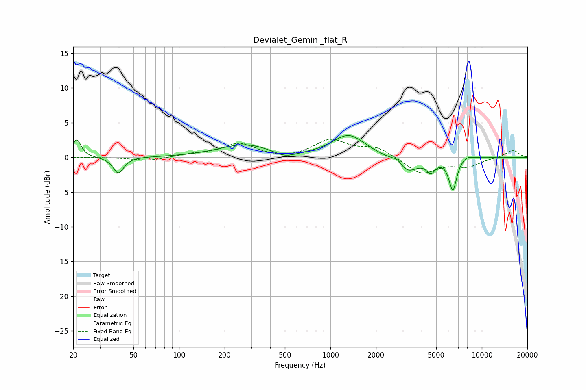

# Devialet_Gemini_flat_R
See [usage instructions](https://github.com/jaakkopasanen/AutoEq#usage) for more options and info.

### Parametric EQs
Apply preamp of -3.2 dB when using parametric equalizer.

|   # | Type    |   Fc (Hz) |    Q |   Gain (dB) |
|-----|---------|-----------|------|-------------|
|   1 | Peaking |        21 | 5.28 |         2.6 |
|   2 | Peaking |        40 | 4.2  |        -2.4 |
|   3 | Peaking |       272 | 0.82 |         1.8 |
|   4 | Peaking |       501 | 1.96 |        -0.9 |
|   5 | Peaking |      1320 | 1.3  |         3.2 |
|   6 | Peaking |      2782 | 3.95 |         1   |
|   7 | Peaking |      3168 | 1.96 |        -2.4 |
|   8 | Peaking |      4606 | 4.99 |        -1.7 |
|   9 | Peaking |      6434 | 5.24 |        -4.6 |
|  10 | Peaking |      7966 | 3.03 |         0.5 |

### Fixed Band EQs
When using fixed band (also called graphic) equalizer, apply preamp of **-2.7 dB** (if available) and set gains manually with these parameters.

|   # | Type    |   Fc (Hz) |    Q |   Gain (dB) |
|-----|---------|-----------|------|-------------|
|   1 | Peaking |        31 | 1.41 |         0   |
|   2 | Peaking |        62 | 1.41 |        -0.5 |
|   3 | Peaking |       125 | 1.41 |         0.4 |
|   4 | Peaking |       250 | 1.41 |         1.9 |
|   5 | Peaking |       500 | 1.41 |        -0.3 |
|   6 | Peaking |      1000 | 1.41 |         2.4 |
|   7 | Peaking |      2000 | 1.41 |         1.4 |
|   8 | Peaking |      4000 | 1.41 |        -2.4 |
|   9 | Peaking |      8000 | 1.41 |        -1.2 |
|  10 | Peaking |     16000 | 1.41 |         1.1 |

### Graphs

