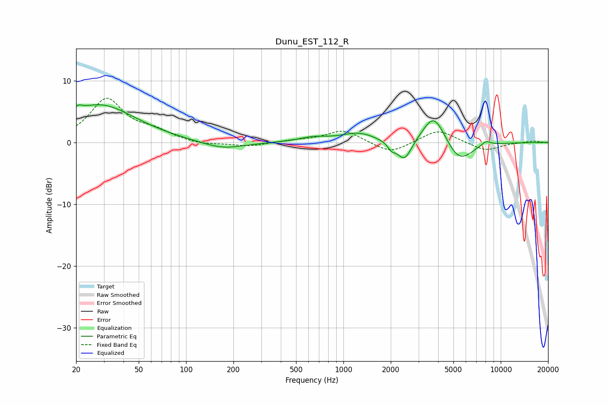

# Dunu_EST_112_R
See [usage instructions](https://github.com/jaakkopasanen/AutoEq#usage) for more options and info.

### Parametric EQs
Apply preamp of -6.2 dB when using parametric equalizer.

|   # | Type    |   Fc (Hz) |    Q |   Gain (dB) |
|-----|---------|-----------|------|-------------|
|   1 | Peaking |        21 | 5.91 |         0.8 |
|   2 | Peaking |        28 | 0.62 |         6.1 |
|   3 | Peaking |       171 | 1.07 |        -1.2 |
|   4 | Peaking |       643 | 1.58 |         0.7 |
|   5 | Peaking |      1248 | 1.32 |         1.5 |
|   6 | Peaking |      2019 | 5.84 |        -1   |
|   7 | Peaking |      2442 | 3    |        -3.5 |
|   8 | Peaking |      3758 | 1.98 |         5   |
|   9 | Peaking |      5442 | 1.67 |        -3.5 |
|  10 | Peaking |      8038 | 4.25 |         0.8 |

### Fixed Band EQs
When using fixed band (also called graphic) equalizer, apply preamp of **-7.2 dB** (if available) and set gains manually with these parameters.

|   # | Type    |   Fc (Hz) |    Q |   Gain (dB) |
|-----|---------|-----------|------|-------------|
|   1 | Peaking |        31 | 1.41 |         6.9 |
|   2 | Peaking |        62 | 1.41 |         1.5 |
|   3 | Peaking |       125 | 1.41 |        -0.5 |
|   4 | Peaking |       250 | 1.41 |        -0.7 |
|   5 | Peaking |       500 | 1.41 |         0.3 |
|   6 | Peaking |      1000 | 1.41 |         2   |
|   7 | Peaking |      2000 | 1.41 |        -1.9 |
|   8 | Peaking |      4000 | 1.41 |         2.1 |
|   9 | Peaking |      8000 | 1.41 |        -1.4 |
|  10 | Peaking |     16000 | 1.41 |         0.3 |

### Graphs

