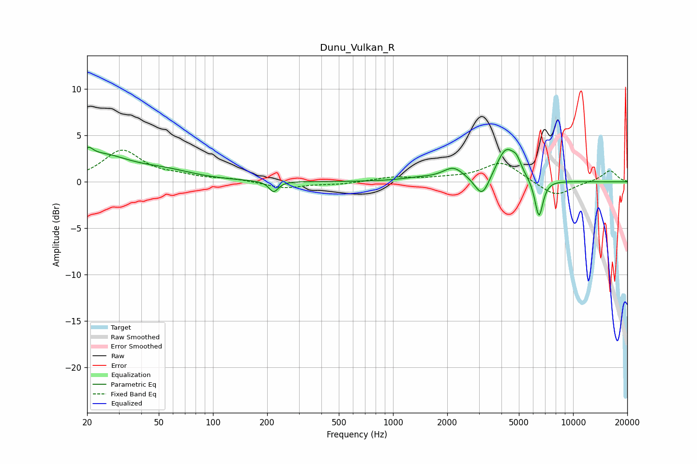

# Dunu_Vulkan_R
See [usage instructions](https://github.com/jaakkopasanen/AutoEq#usage) for more options and info.

### Parametric EQs
Apply preamp of -3.8 dB when using parametric equalizer.

|   # | Type    |   Fc (Hz) |    Q |   Gain (dB) |
|-----|---------|-----------|------|-------------|
|   1 | Peaking |        20 | 5.61 |         1   |
|   2 | Peaking |        23 | 0.85 |         2.7 |
|   3 | Peaking |        55 | 0.89 |         0.8 |
|   4 | Peaking |       217 | 5.61 |        -1.2 |
|   5 | Peaking |      1391 | 1.39 |         0.3 |
|   6 | Peaking |      2167 | 2.38 |         1.4 |
|   7 | Peaking |      3127 | 3.52 |        -2.3 |
|   8 | Peaking |      4241 | 2.56 |         3.6 |
|   9 | Peaking |      4865 | 5.68 |         1   |
|  10 | Peaking |      6461 | 6    |        -4.1 |

### Fixed Band EQs
When using fixed band (also called graphic) equalizer, apply preamp of **-3.5 dB** (if available) and set gains manually with these parameters.

|   # | Type    |   Fc (Hz) |    Q |   Gain (dB) |
|-----|---------|-----------|------|-------------|
|   1 | Peaking |        31 | 1.41 |         3.3 |
|   2 | Peaking |        62 | 1.41 |         0.5 |
|   3 | Peaking |       125 | 1.41 |         0.3 |
|   4 | Peaking |       250 | 1.41 |        -0.7 |
|   5 | Peaking |       500 | 1.41 |        -0.2 |
|   6 | Peaking |      1000 | 1.41 |         0.5 |
|   7 | Peaking |      2000 | 1.41 |         0.3 |
|   8 | Peaking |      4000 | 1.41 |         2.1 |
|   9 | Peaking |      8000 | 1.41 |        -1.6 |
|  10 | Peaking |     16000 | 1.41 |         1.3 |

### Graphs

