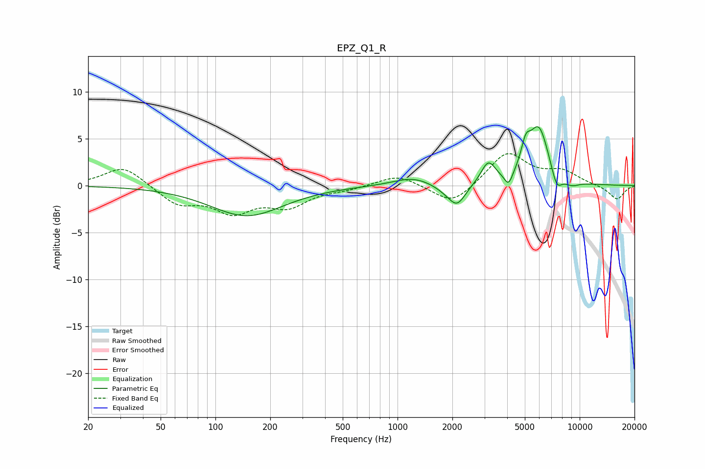

# EPZ_Q1_R
See [usage instructions](https://github.com/jaakkopasanen/AutoEq#usage) for more options and info.

### Parametric EQs
Apply preamp of -6.4 dB when using parametric equalizer.

|   # | Type    |   Fc (Hz) |    Q |   Gain (dB) |
|-----|---------|-----------|------|-------------|
|   1 | Peaking |       148 | 0.71 |        -3.2 |
|   2 | Peaking |      1219 | 1.3  |         0.9 |
|   3 | Peaking |      1901 | 2.01 |        -0.7 |
|   4 | Peaking |      2129 | 3.1  |        -1.9 |
|   5 | Peaking |      3148 | 3.6  |         2.3 |
|   6 | Peaking |      4071 | 6    |        -1.5 |
|   7 | Peaking |      5055 | 5.51 |         2.2 |
|   8 | Peaking |      5961 | 2.39 |         6.1 |
|   9 | Peaking |      7474 | 4.47 |        -2   |
|  10 | Peaking |      9040 | 3.1  |        -0.6 |

### Fixed Band EQs
When using fixed band (also called graphic) equalizer, apply preamp of **-3.5 dB** (if available) and set gains manually with these parameters.

|   # | Type    |   Fc (Hz) |    Q |   Gain (dB) |
|-----|---------|-----------|------|-------------|
|   1 | Peaking |        31 | 1.41 |         2.1 |
|   2 | Peaking |        62 | 1.41 |        -1.9 |
|   3 | Peaking |       125 | 1.41 |        -2.6 |
|   4 | Peaking |       250 | 1.41 |        -2   |
|   5 | Peaking |       500 | 1.41 |        -0.3 |
|   6 | Peaking |      1000 | 1.41 |         1.2 |
|   7 | Peaking |      2000 | 1.41 |        -2.2 |
|   8 | Peaking |      4000 | 1.41 |         3.5 |
|   9 | Peaking |      8000 | 1.41 |         1.4 |
|  10 | Peaking |     16000 | 1.41 |        -1.5 |

### Graphs

