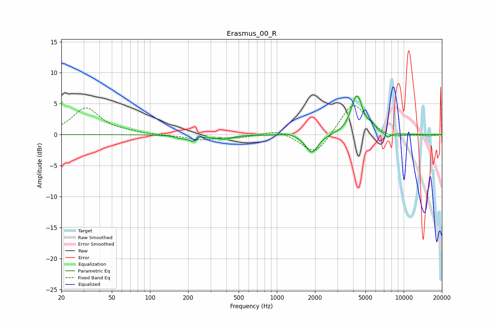

# Erasmus_00_R
See [usage instructions](https://github.com/jaakkopasanen/AutoEq#usage) for more options and info.

### Parametric EQs
Apply preamp of -6.3 dB when using parametric equalizer.

|   # | Type    |   Fc (Hz) |    Q |   Gain (dB) |
|-----|---------|-----------|------|-------------|
|   1 | Peaking |       170 | 4.3  |        -0.3 |
|   2 | Peaking |       227 | 2.69 |        -1.2 |
|   3 | Peaking |       247 | 6    |         0.7 |
|   4 | Peaking |       387 | 2.42 |        -0.6 |
|   5 | Peaking |      1233 | 3.03 |         0.4 |
|   6 | Peaking |      1889 | 2.91 |        -3   |
|   7 | Peaking |      3922 | 6    |         0.5 |
|   8 | Peaking |      4297 | 3.17 |         6.1 |
|   9 | Peaking |      5576 | 6    |         0.8 |
|  10 | Peaking |      7493 | 6    |        -0.7 |

### Fixed Band EQs
When using fixed band (also called graphic) equalizer, apply preamp of **-4.8 dB** (if available) and set gains manually with these parameters.

|   # | Type    |   Fc (Hz) |    Q |   Gain (dB) |
|-----|---------|-----------|------|-------------|
|   1 | Peaking |        31 | 1.41 |         4.3 |
|   2 | Peaking |        62 | 1.41 |         0.3 |
|   3 | Peaking |       125 | 1.41 |        -0.1 |
|   4 | Peaking |       250 | 1.41 |        -0.8 |
|   5 | Peaking |       500 | 1.41 |        -0.4 |
|   6 | Peaking |      1000 | 1.41 |         0.9 |
|   7 | Peaking |      2000 | 1.41 |        -3.5 |
|   8 | Peaking |      4000 | 1.41 |         5.4 |
|   9 | Peaking |      8000 | 1.41 |        -0.8 |
|  10 | Peaking |     16000 | 1.41 |        -0.2 |

### Graphs

