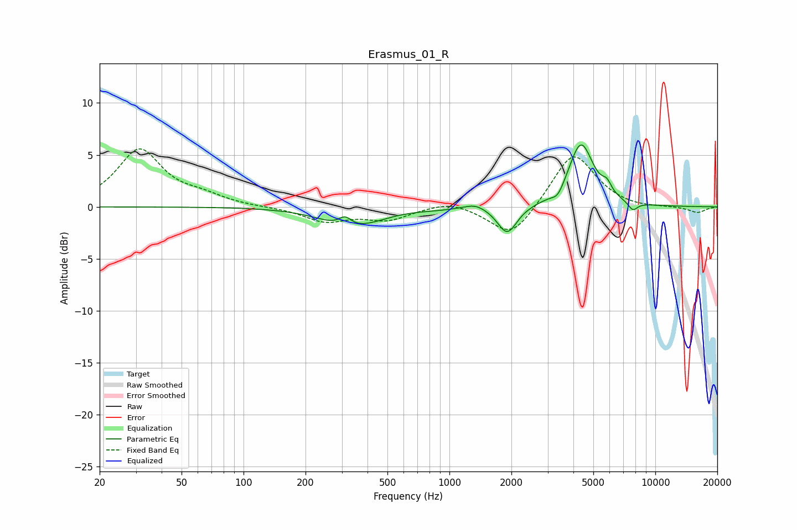

# Erasmus_01_R
See [usage instructions](https://github.com/jaakkopasanen/AutoEq#usage) for more options and info.

### Parametric EQs
Apply preamp of -6.1 dB when using parametric equalizer.

|   # | Type    |   Fc (Hz) |    Q |   Gain (dB) |
|-----|---------|-----------|------|-------------|
|   1 | Peaking |       311 | 4.54 |         0.9 |
|   2 | Peaking |       315 | 1.11 |        -1.6 |
|   3 | Peaking |       415 | 1.3  |        -0.4 |
|   4 | Peaking |       864 | 1.66 |        -0.1 |
|   5 | Peaking |      1335 | 2.7  |         0.5 |
|   6 | Peaking |      1910 | 3    |        -2.7 |
|   7 | Peaking |      3365 | 4.85 |        -0.9 |
|   8 | Peaking |      4354 | 2.33 |         6.1 |
|   9 | Peaking |      5817 | 6    |         0.9 |
|  10 | Peaking |      7777 | 5.71 |        -0.8 |

### Fixed Band EQs
When using fixed band (also called graphic) equalizer, apply preamp of **-5.7 dB** (if available) and set gains manually with these parameters.

|   # | Type    |   Fc (Hz) |    Q |   Gain (dB) |
|-----|---------|-----------|------|-------------|
|   1 | Peaking |        31 | 1.41 |         5.4 |
|   2 | Peaking |        62 | 1.41 |         0.8 |
|   3 | Peaking |       125 | 1.41 |        -0   |
|   4 | Peaking |       250 | 1.41 |        -1.4 |
|   5 | Peaking |       500 | 1.41 |        -1.2 |
|   6 | Peaking |      1000 | 1.41 |         0.7 |
|   7 | Peaking |      2000 | 1.41 |        -3.1 |
|   8 | Peaking |      4000 | 1.41 |         5.4 |
|   9 | Peaking |      8000 | 1.41 |        -0.2 |
|  10 | Peaking |     16000 | 1.41 |        -0.6 |

### Graphs

