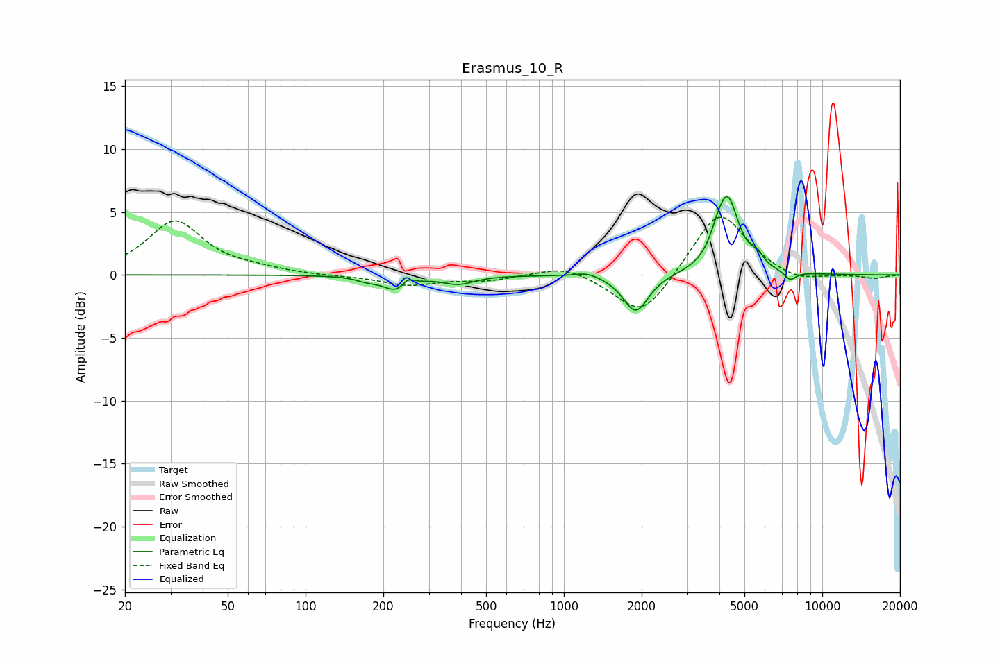

# Erasmus_10_R
See [usage instructions](https://github.com/jaakkopasanen/AutoEq#usage) for more options and info.

### Parametric EQs
Apply preamp of -6.3 dB when using parametric equalizer.

|   # | Type    |   Fc (Hz) |    Q |   Gain (dB) |
|-----|---------|-----------|------|-------------|
|   1 | Peaking |       172 | 3.67 |        -0.3 |
|   2 | Peaking |       226 | 2.76 |        -1.3 |
|   3 | Peaking |       249 | 6    |         0.7 |
|   4 | Peaking |       391 | 2.42 |        -0.7 |
|   5 | Peaking |      1232 | 2.98 |         0.4 |
|   6 | Peaking |      1899 | 2.92 |        -3   |
|   7 | Peaking |      3885 | 6    |         0.6 |
|   8 | Peaking |      4289 | 3.19 |         6.1 |
|   9 | Peaking |      5600 | 6    |         0.8 |
|  10 | Peaking |      7511 | 6    |        -0.7 |

### Fixed Band EQs
When using fixed band (also called graphic) equalizer, apply preamp of **-4.7 dB** (if available) and set gains manually with these parameters.

|   # | Type    |   Fc (Hz) |    Q |   Gain (dB) |
|-----|---------|-----------|------|-------------|
|   1 | Peaking |        31 | 1.41 |         4.2 |
|   2 | Peaking |        62 | 1.41 |         0.3 |
|   3 | Peaking |       125 | 1.41 |        -0.1 |
|   4 | Peaking |       250 | 1.41 |        -0.8 |
|   5 | Peaking |       500 | 1.41 |        -0.4 |
|   6 | Peaking |      1000 | 1.41 |         0.9 |
|   7 | Peaking |      2000 | 1.41 |        -3.6 |
|   8 | Peaking |      4000 | 1.41 |         5.3 |
|   9 | Peaking |      8000 | 1.41 |        -0.7 |
|  10 | Peaking |     16000 | 1.41 |        -0.3 |

### Graphs

