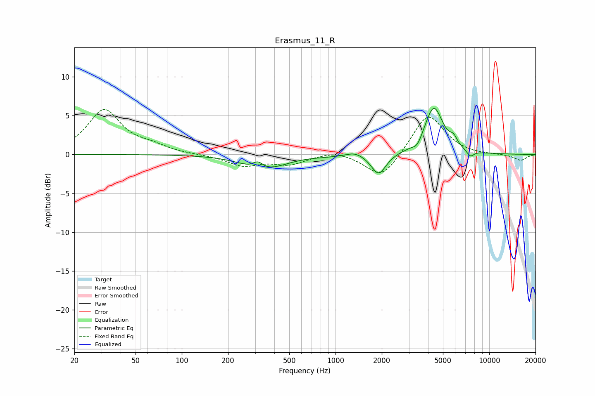

# Erasmus_11_R
See [usage instructions](https://github.com/jaakkopasanen/AutoEq#usage) for more options and info.

### Parametric EQs
Apply preamp of -6.0 dB when using parametric equalizer.

|   # | Type    |   Fc (Hz) |    Q |   Gain (dB) |
|-----|---------|-----------|------|-------------|
|   1 | Peaking |       313 | 4.42 |         0.9 |
|   2 | Peaking |       321 | 1.13 |        -1.6 |
|   3 | Peaking |       419 | 1.27 |        -0.4 |
|   4 | Peaking |       870 | 1.74 |        -0.1 |
|   5 | Peaking |      1340 | 2.67 |         0.5 |
|   6 | Peaking |      1908 | 2.98 |        -2.7 |
|   7 | Peaking |      3408 | 4.66 |        -0.9 |
|   8 | Peaking |      4357 | 2.33 |         6.1 |
|   9 | Peaking |      5863 | 5.91 |         1   |
|  10 | Peaking |      7538 | 5.69 |        -0.8 |

### Fixed Band EQs
When using fixed band (also called graphic) equalizer, apply preamp of **-5.9 dB** (if available) and set gains manually with these parameters.

|   # | Type    |   Fc (Hz) |    Q |   Gain (dB) |
|-----|---------|-----------|------|-------------|
|   1 | Peaking |        31 | 1.41 |         5.7 |
|   2 | Peaking |        62 | 1.41 |         0.8 |
|   3 | Peaking |       125 | 1.41 |        -0   |
|   4 | Peaking |       250 | 1.41 |        -1.4 |
|   5 | Peaking |       500 | 1.41 |        -1.2 |
|   6 | Peaking |      1000 | 1.41 |         0.6 |
|   7 | Peaking |      2000 | 1.41 |        -3.3 |
|   8 | Peaking |      4000 | 1.41 |         5.4 |
|   9 | Peaking |      8000 | 1.41 |        -0.1 |
|  10 | Peaking |     16000 | 1.41 |        -0.8 |

### Graphs

