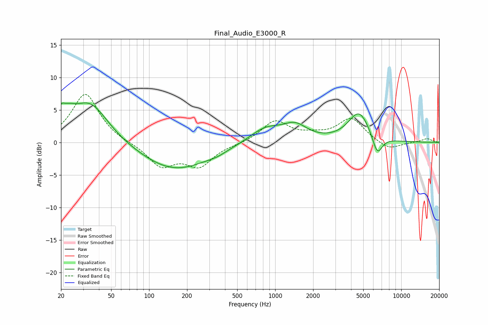

# Final_Audio_E3000_R
See [usage instructions](https://github.com/jaakkopasanen/AutoEq#usage) for more options and info.

### Parametric EQs
Apply preamp of -6.2 dB when using parametric equalizer.

|   # | Type    |   Fc (Hz) |    Q |   Gain (dB) |
|-----|---------|-----------|------|-------------|
|   1 | Peaking |        20 | 5.19 |         2   |
|   2 | Peaking |        22 | 2.39 |        -0.8 |
|   3 | Peaking |        23 | 2.44 |         2.6 |
|   4 | Peaking |        34 | 0.97 |         6.2 |
|   5 | Peaking |       159 | 0.52 |        -4.3 |
|   6 | Peaking |       345 | 1.87 |        -0.4 |
|   7 | Peaking |       839 | 1.09 |         2.3 |
|   8 | Peaking |      1441 | 1.49 |         2.2 |
|   9 | Peaking |      4630 | 1.63 |         4.6 |
|  10 | Peaking |      6459 | 3.41 |        -3.1 |

### Fixed Band EQs
When using fixed band (also called graphic) equalizer, apply preamp of **-7.5 dB** (if available) and set gains manually with these parameters.

|   # | Type    |   Fc (Hz) |    Q |   Gain (dB) |
|-----|---------|-----------|------|-------------|
|   1 | Peaking |        31 | 1.41 |         7.5 |
|   2 | Peaking |        62 | 1.41 |        -0.1 |
|   3 | Peaking |       125 | 1.41 |        -3.5 |
|   4 | Peaking |       250 | 1.41 |        -3.4 |
|   5 | Peaking |       500 | 1.41 |        -0.2 |
|   6 | Peaking |      1000 | 1.41 |         3.2 |
|   7 | Peaking |      2000 | 1.41 |         0.8 |
|   8 | Peaking |      4000 | 1.41 |         3.6 |
|   9 | Peaking |      8000 | 1.41 |        -1.3 |
|  10 | Peaking |     16000 | 1.41 |         0.6 |

### Graphs

