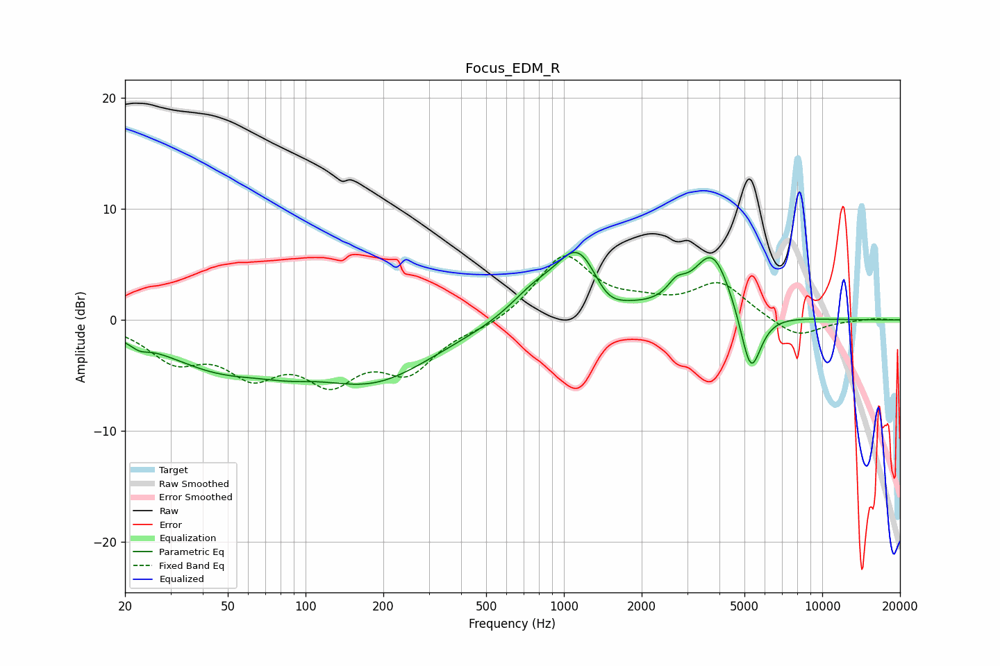

# Focus_EDM_R
See [usage instructions](https://github.com/jaakkopasanen/AutoEq#usage) for more options and info.

### Parametric EQs
Apply preamp of -6.2 dB when using parametric equalizer.

|   # | Type    |   Fc (Hz) |    Q |   Gain (dB) |
|-----|---------|-----------|------|-------------|
|   1 | Peaking |        23 | 4.32 |        -0.6 |
|   2 | Peaking |        47 | 0.62 |        -3.8 |
|   3 | Peaking |        85 | 1.36 |        -0.7 |
|   4 | Peaking |       184 | 0.6  |        -5   |
|   5 | Peaking |       755 | 1.5  |         1.8 |
|   6 | Peaking |      1145 | 1.49 |         6.5 |
|   7 | Peaking |      1459 | 2.15 |        -2   |
|   8 | Peaking |      2726 | 3.95 |         1.4 |
|   9 | Peaking |      3766 | 1.86 |         6   |
|  10 | Peaking |      5289 | 3.41 |        -6.1 |

### Fixed Band EQs
When using fixed band (also called graphic) equalizer, apply preamp of **-5.9 dB** (if available) and set gains manually with these parameters.

|   # | Type    |   Fc (Hz) |    Q |   Gain (dB) |
|-----|---------|-----------|------|-------------|
|   1 | Peaking |        31 | 1.41 |        -3.2 |
|   2 | Peaking |        62 | 1.41 |        -4.1 |
|   3 | Peaking |       125 | 1.41 |        -4.7 |
|   4 | Peaking |       250 | 1.41 |        -4.1 |
|   5 | Peaking |       500 | 1.41 |        -0.7 |
|   6 | Peaking |      1000 | 1.41 |         5.8 |
|   7 | Peaking |      2000 | 1.41 |         1   |
|   8 | Peaking |      4000 | 1.41 |         3.2 |
|   9 | Peaking |      8000 | 1.41 |        -1.7 |
|  10 | Peaking |     16000 | 1.41 |         0.2 |

### Graphs

