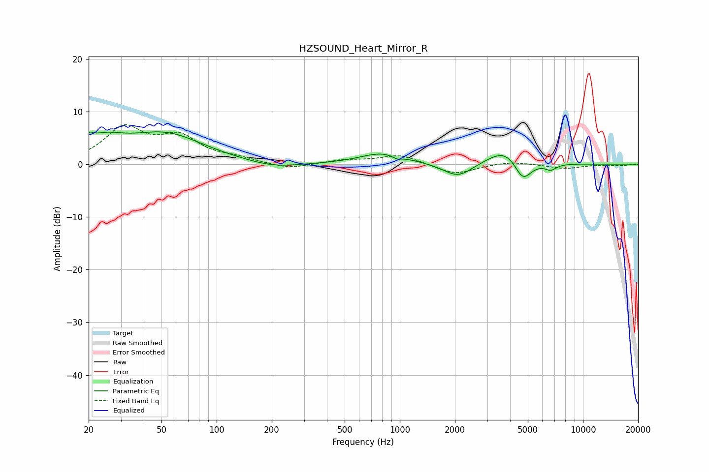

# HZSOUND_Heart_Mirror_R
See [usage instructions](https://github.com/jaakkopasanen/AutoEq#usage) for more options and info.

### Parametric EQs
Apply preamp of -6.2 dB when using parametric equalizer.

|   # | Type    |   Fc (Hz) |    Q |   Gain (dB) |
|-----|---------|-----------|------|-------------|
|   1 | Peaking |        20 | 5.99 |         1.4 |
|   2 | Peaking |        24 | 1.26 |         3.4 |
|   3 | Peaking |        52 | 0.67 |         5.5 |
|   4 | Peaking |       204 | 1.01 |        -1.1 |
|   5 | Peaking |       807 | 1.16 |         2.1 |
|   6 | Peaking |       965 | 5.34 |        -0.6 |
|   7 | Peaking |      2077 | 1.78 |        -2.8 |
|   8 | Peaking |      3816 | 1.46 |         3.4 |
|   9 | Peaking |      4689 | 2.89 |        -4.4 |
|  10 | Peaking |      6669 | 4.31 |        -1.1 |

### Fixed Band EQs
When using fixed band (also called graphic) equalizer, apply preamp of **-7.6 dB** (if available) and set gains manually with these parameters.

|   # | Type    |   Fc (Hz) |    Q |   Gain (dB) |
|-----|---------|-----------|------|-------------|
|   1 | Peaking |        31 | 1.41 |         6.6 |
|   2 | Peaking |        62 | 1.41 |         4.6 |
|   3 | Peaking |       125 | 1.41 |         0.9 |
|   4 | Peaking |       250 | 1.41 |        -1   |
|   5 | Peaking |       500 | 1.41 |         0.7 |
|   6 | Peaking |      1000 | 1.41 |         1.8 |
|   7 | Peaking |      2000 | 1.41 |        -2   |
|   8 | Peaking |      4000 | 1.41 |         0.6 |
|   9 | Peaking |      8000 | 1.41 |        -0.8 |
|  10 | Peaking |     16000 | 1.41 |        -0.3 |

### Graphs

