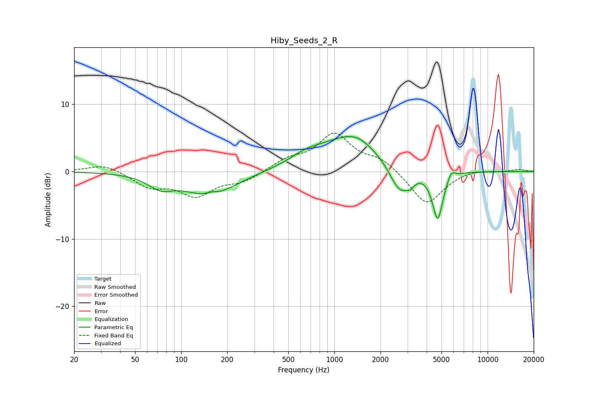

# Hiby_Seeds_2_R
See [usage instructions](https://github.com/jaakkopasanen/AutoEq#usage) for more options and info.

### Parametric EQs
Apply preamp of -5.3 dB when using parametric equalizer.

|   # | Type    |   Fc (Hz) |    Q |   Gain (dB) |
|-----|---------|-----------|------|-------------|
|   1 | Peaking |        73 | 1.76 |        -1.8 |
|   2 | Peaking |       154 | 0.87 |        -3.5 |
|   3 | Peaking |       158 | 3.64 |         0.5 |
|   4 | Peaking |       662 | 1.18 |         1.5 |
|   5 | Peaking |      1308 | 0.77 |         5.1 |
|   6 | Peaking |      1450 | 2.62 |         0.2 |
|   7 | Peaking |      2675 | 2.09 |        -4.3 |
|   8 | Peaking |      3136 | 6    |        -0.8 |
|   9 | Peaking |      4725 | 4.04 |        -7.2 |
|  10 | Peaking |      5792 | 5.66 |         1.2 |

### Fixed Band EQs
When using fixed band (also called graphic) equalizer, apply preamp of **-5.8 dB** (if available) and set gains manually with these parameters.

|   # | Type    |   Fc (Hz) |    Q |   Gain (dB) |
|-----|---------|-----------|------|-------------|
|   1 | Peaking |        31 | 1.41 |         1.2 |
|   2 | Peaking |        62 | 1.41 |        -2.1 |
|   3 | Peaking |       125 | 1.41 |        -3.4 |
|   4 | Peaking |       250 | 1.41 |        -1.4 |
|   5 | Peaking |       500 | 1.41 |         1.5 |
|   6 | Peaking |      1000 | 1.41 |         5.4 |
|   7 | Peaking |      2000 | 1.41 |         1.7 |
|   8 | Peaking |      4000 | 1.41 |        -5   |
|   9 | Peaking |      8000 | 1.41 |         0.4 |
|  10 | Peaking |     16000 | 1.41 |         0.3 |

### Graphs

