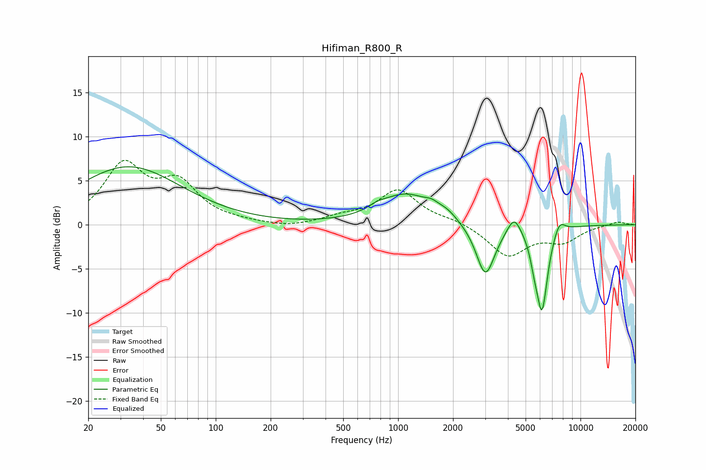

# Hifiman_R800_R
See [usage instructions](https://github.com/jaakkopasanen/AutoEq#usage) for more options and info.

### Parametric EQs
Apply preamp of -6.7 dB when using parametric equalizer.

|   # | Type    |   Fc (Hz) |    Q |   Gain (dB) |
|-----|---------|-----------|------|-------------|
|   1 | Peaking |        33 | 0.49 |         6.6 |
|   2 | Peaking |       774 | 2.71 |         0.5 |
|   3 | Peaking |      1110 | 1    |         3.4 |
|   4 | Peaking |      1528 | 3.85 |         0.5 |
|   5 | Peaking |      1860 | 2.56 |         0.8 |
|   6 | Peaking |      3011 | 2.75 |        -6   |
|   7 | Peaking |      4327 | 3.79 |         2.1 |
|   8 | Peaking |      5589 | 6    |        -1.7 |
|   9 | Peaking |      6150 | 4.36 |        -9.4 |
|  10 | Peaking |      7649 | 4.22 |         1.6 |

### Fixed Band EQs
When using fixed band (also called graphic) equalizer, apply preamp of **-7.4 dB** (if available) and set gains manually with these parameters.

|   # | Type    |   Fc (Hz) |    Q |   Gain (dB) |
|-----|---------|-----------|------|-------------|
|   1 | Peaking |        31 | 1.41 |         6.5 |
|   2 | Peaking |        62 | 1.41 |         4.3 |
|   3 | Peaking |       125 | 1.41 |         0.2 |
|   4 | Peaking |       250 | 1.41 |        -0.4 |
|   5 | Peaking |       500 | 1.41 |         0.7 |
|   6 | Peaking |      1000 | 1.41 |         3.8 |
|   7 | Peaking |      2000 | 1.41 |         0.5 |
|   8 | Peaking |      4000 | 1.41 |        -3.5 |
|   9 | Peaking |      8000 | 1.41 |        -1.7 |
|  10 | Peaking |     16000 | 1.41 |         0.4 |

### Graphs

