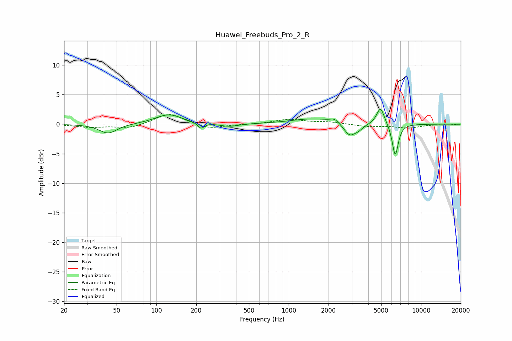

# Huawei_Freebuds_Pro_2_R
See [usage instructions](https://github.com/jaakkopasanen/AutoEq#usage) for more options and info.

### Parametric EQs
Apply preamp of -2.6 dB when using parametric equalizer.

|   # | Type    |   Fc (Hz) |    Q |   Gain (dB) |
|-----|---------|-----------|------|-------------|
|   1 | Peaking |        43 | 2.14 |        -1.6 |
|   2 | Peaking |       124 | 1.42 |         1.6 |
|   3 | Peaking |       217 | 5.99 |        -1   |
|   4 | Peaking |       355 | 2.04 |        -0.5 |
|   5 | Peaking |      1553 | 0.84 |         0.9 |
|   6 | Peaking |      2223 | 4.29 |         0.7 |
|   7 | Peaking |      2887 | 3.18 |        -2.1 |
|   8 | Peaking |      3380 | 4.1  |        -0.7 |
|   9 | Peaking |      4944 | 4.75 |         3   |
|  10 | Peaking |      6389 | 6    |        -5.5 |

### Fixed Band EQs
When using fixed band (also called graphic) equalizer, apply preamp of **-1.7 dB** (if available) and set gains manually with these parameters.

|   # | Type    |   Fc (Hz) |    Q |   Gain (dB) |
|-----|---------|-----------|------|-------------|
|   1 | Peaking |        31 | 1.41 |        -0.5 |
|   2 | Peaking |        62 | 1.41 |        -0.7 |
|   3 | Peaking |       125 | 1.41 |         1.9 |
|   4 | Peaking |       250 | 1.41 |        -0.9 |
|   5 | Peaking |       500 | 1.41 |        -0   |
|   6 | Peaking |      1000 | 1.41 |         0.8 |
|   7 | Peaking |      2000 | 1.41 |         0.3 |
|   8 | Peaking |      4000 | 1.41 |        -0.4 |
|   9 | Peaking |      8000 | 1.41 |        -0.6 |
|  10 | Peaking |     16000 | 1.41 |        -0.1 |

### Graphs

