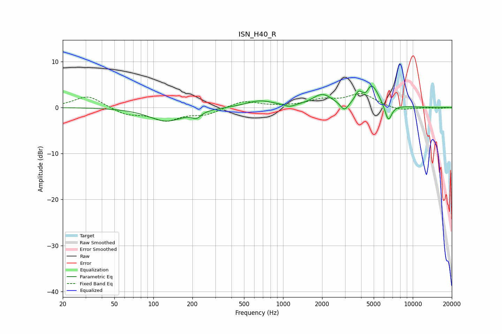

# ISN_H40_R
See [usage instructions](https://github.com/jaakkopasanen/AutoEq#usage) for more options and info.

### Parametric EQs
Apply preamp of -4.7 dB when using parametric equalizer.

|   # | Type    |   Fc (Hz) |    Q |   Gain (dB) |
|-----|---------|-----------|------|-------------|
|   1 | Peaking |       126 | 1.08 |        -2.9 |
|   2 | Peaking |       215 | 4.1  |        -1.3 |
|   3 | Peaking |       662 | 1.31 |         1.4 |
|   4 | Peaking |      1123 | 3.7  |        -0.6 |
|   5 | Peaking |      2008 | 1.89 |         2.7 |
|   6 | Peaking |      2973 | 4.66 |        -1.9 |
|   7 | Peaking |      3805 | 6    |         1.7 |
|   8 | Peaking |      4383 | 6    |        -1.2 |
|   9 | Peaking |      4771 | 2.46 |         5.2 |
|  10 | Peaking |      6477 | 5.03 |        -3.9 |

### Fixed Band EQs
When using fixed band (also called graphic) equalizer, apply preamp of **-3.1 dB** (if available) and set gains manually with these parameters.

|   # | Type    |   Fc (Hz) |    Q |   Gain (dB) |
|-----|---------|-----------|------|-------------|
|   1 | Peaking |        31 | 1.41 |         2.6 |
|   2 | Peaking |        62 | 1.41 |        -1.5 |
|   3 | Peaking |       125 | 1.41 |        -2.6 |
|   4 | Peaking |       250 | 1.41 |        -1.4 |
|   5 | Peaking |       500 | 1.41 |         1.5 |
|   6 | Peaking |      1000 | 1.41 |         0.1 |
|   7 | Peaking |      2000 | 1.41 |         1.5 |
|   8 | Peaking |      4000 | 1.41 |         2.9 |
|   9 | Peaking |      8000 | 1.41 |        -0.8 |
|  10 | Peaking |     16000 | 1.41 |        -0.2 |

### Graphs

