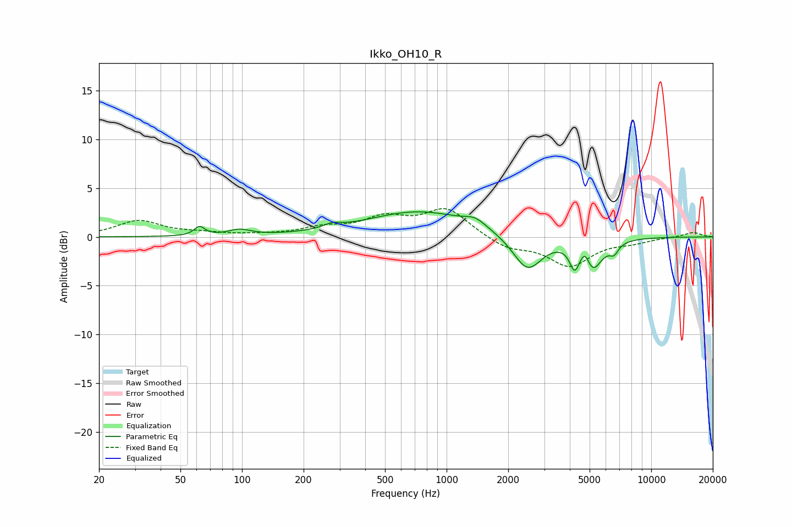

# Ikko_OH10_R
See [usage instructions](https://github.com/jaakkopasanen/AutoEq#usage) for more options and info.

### Parametric EQs
Apply preamp of -2.7 dB when using parametric equalizer.

|   # | Type    |   Fc (Hz) |    Q |   Gain (dB) |
|-----|---------|-----------|------|-------------|
|   1 | Peaking |        62 | 5.69 |         0.9 |
|   2 | Peaking |        97 | 2.59 |         0.6 |
|   3 | Peaking |       276 | 3.45 |         0.4 |
|   4 | Peaking |       738 | 0.54 |         2.6 |
|   5 | Peaking |      1381 | 2.74 |         0.8 |
|   6 | Peaking |      2485 | 1.97 |        -3.7 |
|   7 | Peaking |      4222 | 6    |        -2.3 |
|   8 | Peaking |      4750 | 6    |         1.6 |
|   9 | Peaking |      5141 | 2.93 |        -3.3 |
|  10 | Peaking |      6576 | 6    |        -1   |

### Fixed Band EQs
When using fixed band (also called graphic) equalizer, apply preamp of **-3.0 dB** (if available) and set gains manually with these parameters.

|   # | Type    |   Fc (Hz) |    Q |   Gain (dB) |
|-----|---------|-----------|------|-------------|
|   1 | Peaking |        31 | 1.41 |         1.6 |
|   2 | Peaking |        62 | 1.41 |         0.3 |
|   3 | Peaking |       125 | 1.41 |         0.1 |
|   4 | Peaking |       250 | 1.41 |         0.8 |
|   5 | Peaking |       500 | 1.41 |         1.8 |
|   6 | Peaking |      1000 | 1.41 |         2.8 |
|   7 | Peaking |      2000 | 1.41 |        -1.1 |
|   8 | Peaking |      4000 | 1.41 |        -2.9 |
|   9 | Peaking |      8000 | 1.41 |        -0.5 |
|  10 | Peaking |     16000 | 1.41 |         0.5 |

### Graphs

