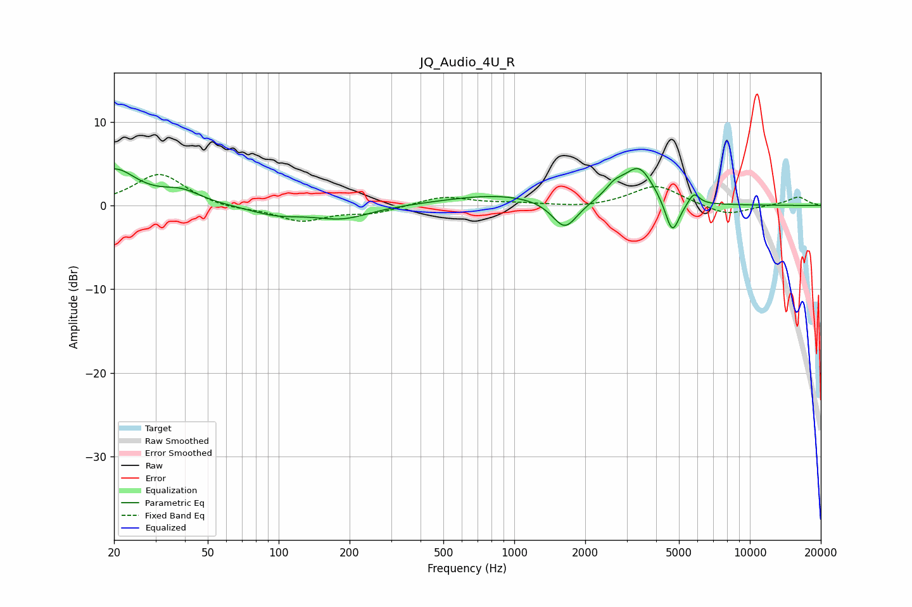

# JQ_Audio_4U_R
See [usage instructions](https://github.com/jaakkopasanen/AutoEq#usage) for more options and info.

### Parametric EQs
Apply preamp of -4.5 dB when using parametric equalizer.

|   # | Type    |   Fc (Hz) |    Q |   Gain (dB) |
|-----|---------|-----------|------|-------------|
|   1 | Peaking |        20 | 1.5  |         4.2 |
|   2 | Peaking |        39 | 1.69 |         1.4 |
|   3 | Peaking |        98 | 1.22 |        -1.1 |
|   4 | Peaking |       186 | 1.19 |        -1.5 |
|   5 | Peaking |       860 | 0.63 |         1.3 |
|   6 | Peaking |      1640 | 2.63 |        -3.5 |
|   7 | Peaking |      2664 | 3.5  |         1.3 |
|   8 | Peaking |      3381 | 2.22 |         4.4 |
|   9 | Peaking |      4686 | 4.67 |        -4.2 |
|  10 | Peaking |      5791 | 6    |         1.4 |

### Fixed Band EQs
When using fixed band (also called graphic) equalizer, apply preamp of **-3.8 dB** (if available) and set gains manually with these parameters.

|   # | Type    |   Fc (Hz) |    Q |   Gain (dB) |
|-----|---------|-----------|------|-------------|
|   1 | Peaking |        31 | 1.41 |         3.8 |
|   2 | Peaking |        62 | 1.41 |        -0.5 |
|   3 | Peaking |       125 | 1.41 |        -1.8 |
|   4 | Peaking |       250 | 1.41 |        -0.9 |
|   5 | Peaking |       500 | 1.41 |         1.1 |
|   6 | Peaking |      1000 | 1.41 |         0.2 |
|   7 | Peaking |      2000 | 1.41 |        -0.3 |
|   8 | Peaking |      4000 | 1.41 |         2.5 |
|   9 | Peaking |      8000 | 1.41 |        -1.2 |
|  10 | Peaking |     16000 | 1.41 |         1   |

### Graphs

