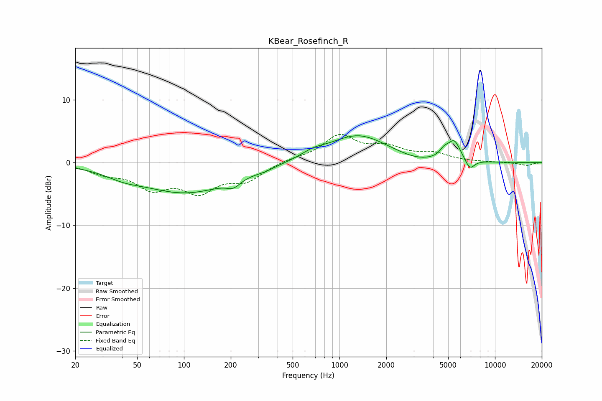

# KBear_Rosefinch_R
See [usage instructions](https://github.com/jaakkopasanen/AutoEq#usage) for more options and info.

### Parametric EQs
Apply preamp of -4.4 dB when using parametric equalizer.

|   # | Type    |   Fc (Hz) |    Q |   Gain (dB) |
|-----|---------|-----------|------|-------------|
|   1 | Peaking |        41 | 1.26 |        -0.9 |
|   2 | Peaking |       103 | 0.48 |        -4.7 |
|   3 | Peaking |       208 | 3.23 |        -1.2 |
|   4 | Peaking |       329 | 2.31 |        -0.4 |
|   5 | Peaking |       674 | 1.86 |         0.8 |
|   6 | Peaking |      1315 | 0.74 |         4.4 |
|   7 | Peaking |      3133 | 1.29 |        -0.6 |
|   8 | Peaking |      4706 | 4.74 |         1.1 |
|   9 | Peaking |      5471 | 3.41 |         3.1 |
|  10 | Peaking |      6893 | 4.46 |        -1.7 |

### Fixed Band EQs
When using fixed band (also called graphic) equalizer, apply preamp of **-4.6 dB** (if available) and set gains manually with these parameters.

|   # | Type    |   Fc (Hz) |    Q |   Gain (dB) |
|-----|---------|-----------|------|-------------|
|   1 | Peaking |        31 | 1.41 |        -1.5 |
|   2 | Peaking |        62 | 1.41 |        -3.6 |
|   3 | Peaking |       125 | 1.41 |        -4.1 |
|   4 | Peaking |       250 | 1.41 |        -2.6 |
|   5 | Peaking |       500 | 1.41 |         0.5 |
|   6 | Peaking |      1000 | 1.41 |         4.1 |
|   7 | Peaking |      2000 | 1.41 |         2.1 |
|   8 | Peaking |      4000 | 1.41 |         1.3 |
|   9 | Peaking |      8000 | 1.41 |         0   |
|  10 | Peaking |     16000 | 1.41 |        -0.5 |

### Graphs

