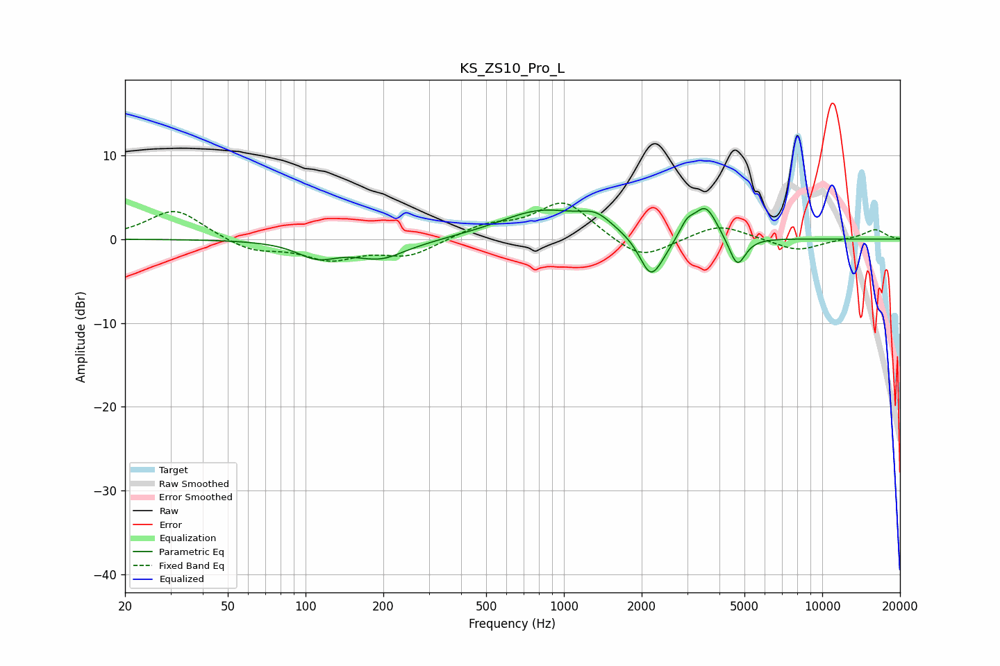

# KS_ZS10_Pro_L
See [usage instructions](https://github.com/jaakkopasanen/AutoEq#usage) for more options and info.

### Parametric EQs
Apply preamp of -3.7 dB when using parametric equalizer.

|   # | Type    |   Fc (Hz) |    Q |   Gain (dB) |
|-----|---------|-----------|------|-------------|
|   1 | Peaking |       111 | 1.85 |        -1.8 |
|   2 | Peaking |       204 | 1.29 |        -3.1 |
|   3 | Peaking |       225 | 1.58 |         0.9 |
|   4 | Peaking |       819 | 0.87 |         3.3 |
|   5 | Peaking |      1331 | 2.26 |         1.7 |
|   6 | Peaking |      2161 | 3.29 |        -4.4 |
|   7 | Peaking |      2369 | 2.73 |        -1.1 |
|   8 | Peaking |      2994 | 4.94 |         1.6 |
|   9 | Peaking |      3537 | 3.13 |         3.9 |
|  10 | Peaking |      4688 | 4.36 |        -3.7 |

### Fixed Band EQs
When using fixed band (also called graphic) equalizer, apply preamp of **-4.4 dB** (if available) and set gains manually with these parameters.

|   # | Type    |   Fc (Hz) |    Q |   Gain (dB) |
|-----|---------|-----------|------|-------------|
|   1 | Peaking |        31 | 1.41 |         3.6 |
|   2 | Peaking |        62 | 1.41 |        -1.4 |
|   3 | Peaking |       125 | 1.41 |        -2.2 |
|   4 | Peaking |       250 | 1.41 |        -1.9 |
|   5 | Peaking |       500 | 1.41 |         1.5 |
|   6 | Peaking |      1000 | 1.41 |         4.5 |
|   7 | Peaking |      2000 | 1.41 |        -2.7 |
|   8 | Peaking |      4000 | 1.41 |         1.8 |
|   9 | Peaking |      8000 | 1.41 |        -1.5 |
|  10 | Peaking |     16000 | 1.41 |         1.2 |

### Graphs

