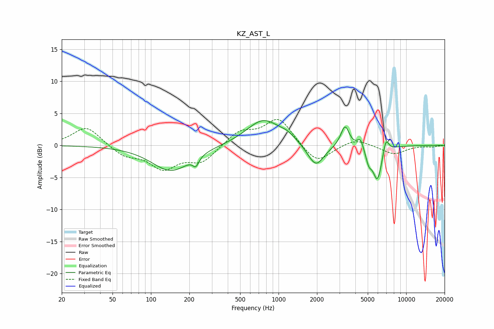

# KZ_AST_L
See [usage instructions](https://github.com/jaakkopasanen/AutoEq#usage) for more options and info.

### Parametric EQs
Apply preamp of -4.0 dB when using parametric equalizer.

|   # | Type    |   Fc (Hz) |    Q |   Gain (dB) |
|-----|---------|-----------|------|-------------|
|   1 | Peaking |       144 | 0.94 |        -4   |
|   2 | Peaking |       225 | 5.98 |        -1.4 |
|   3 | Peaking |       762 | 1.07 |         4   |
|   4 | Peaking |      1179 | 2.4  |         0.8 |
|   5 | Peaking |      1959 | 2.21 |        -3.6 |
|   6 | Peaking |      3316 | 4.26 |         3.3 |
|   7 | Peaking |      4378 | 6    |         1.5 |
|   8 | Peaking |      5088 | 5.98 |        -1.9 |
|   9 | Peaking |      5955 | 3.73 |        -5.4 |
|  10 | Peaking |      6934 | 6    |         2.4 |

### Fixed Band EQs
When using fixed band (also called graphic) equalizer, apply preamp of **-4.1 dB** (if available) and set gains manually with these parameters.

|   # | Type    |   Fc (Hz) |    Q |   Gain (dB) |
|-----|---------|-----------|------|-------------|
|   1 | Peaking |        31 | 1.41 |         3   |
|   2 | Peaking |        62 | 1.41 |        -1.6 |
|   3 | Peaking |       125 | 1.41 |        -3.4 |
|   4 | Peaking |       250 | 1.41 |        -2.5 |
|   5 | Peaking |       500 | 1.41 |         2.1 |
|   6 | Peaking |      1000 | 1.41 |         4.2 |
|   7 | Peaking |      2000 | 1.41 |        -3   |
|   8 | Peaking |      4000 | 1.41 |         1.1 |
|   9 | Peaking |      8000 | 1.41 |        -1.4 |
|  10 | Peaking |     16000 | 1.41 |        -0.2 |

### Graphs

