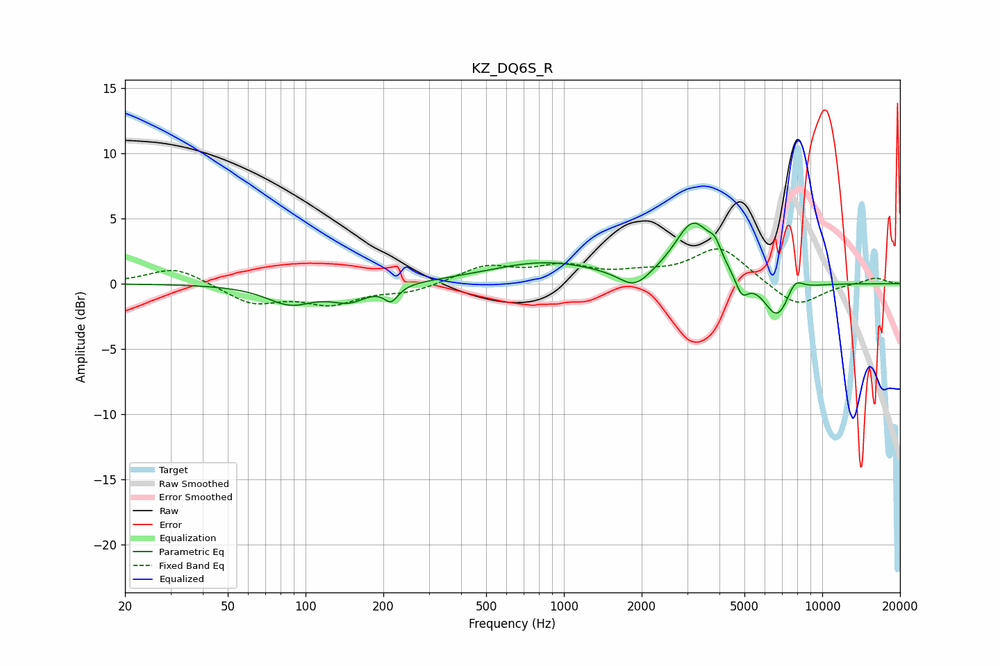

# KZ_DQ6S_R
See [usage instructions](https://github.com/jaakkopasanen/AutoEq#usage) for more options and info.

### Parametric EQs
Apply preamp of -4.7 dB when using parametric equalizer.

|   # | Type    |   Fc (Hz) |    Q |   Gain (dB) |
|-----|---------|-----------|------|-------------|
|   1 | Peaking |        87 | 1.53 |        -1.5 |
|   2 | Peaking |       147 | 2    |        -1.2 |
|   3 | Peaking |       214 | 5.25 |        -1.1 |
|   4 | Peaking |       841 | 0.65 |         1.6 |
|   5 | Peaking |      1875 | 2.39 |        -1.4 |
|   6 | Peaking |      3173 | 1.95 |         4.6 |
|   7 | Peaking |      3849 | 5.83 |         1.1 |
|   8 | Peaking |      4888 | 5.57 |        -1.5 |
|   9 | Peaking |      6699 | 2.64 |        -2.9 |
|  10 | Peaking |      7825 | 4.24 |         1.2 |

### Fixed Band EQs
When using fixed band (also called graphic) equalizer, apply preamp of **-2.8 dB** (if available) and set gains manually with these parameters.

|   # | Type    |   Fc (Hz) |    Q |   Gain (dB) |
|-----|---------|-----------|------|-------------|
|   1 | Peaking |        31 | 1.41 |         1.3 |
|   2 | Peaking |        62 | 1.41 |        -1.5 |
|   3 | Peaking |       125 | 1.41 |        -1.4 |
|   4 | Peaking |       250 | 1.41 |        -0.6 |
|   5 | Peaking |       500 | 1.41 |         1.3 |
|   6 | Peaking |      1000 | 1.41 |         1.2 |
|   7 | Peaking |      2000 | 1.41 |         0.6 |
|   8 | Peaking |      4000 | 1.41 |         2.8 |
|   9 | Peaking |      8000 | 1.41 |        -1.9 |
|  10 | Peaking |     16000 | 1.41 |         0.5 |

### Graphs

