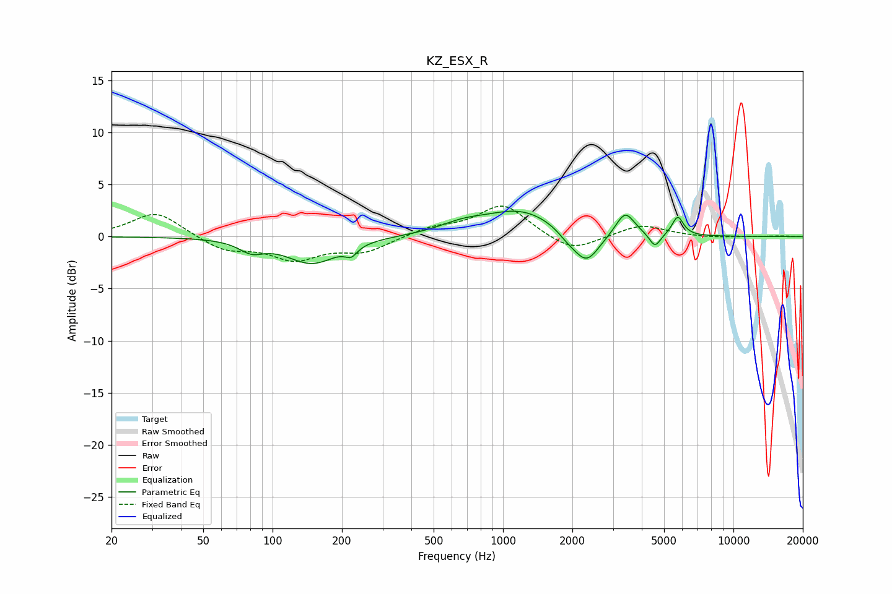

# KZ_ESX_R
See [usage instructions](https://github.com/jaakkopasanen/AutoEq#usage) for more options and info.

### Parametric EQs
Apply preamp of -2.5 dB when using parametric equalizer.

|   # | Type    |   Fc (Hz) |    Q |   Gain (dB) |
|-----|---------|-----------|------|-------------|
|   1 | Peaking |        81 | 2.66 |        -1   |
|   2 | Peaking |       148 | 1.28 |        -2.5 |
|   3 | Peaking |       219 | 5.37 |        -0.9 |
|   4 | Peaking |       669 | 1.41 |         0.8 |
|   5 | Peaking |      1198 | 0.9  |         2.5 |
|   6 | Peaking |      1898 | 3.32 |        -0.6 |
|   7 | Peaking |      2298 | 2.46 |        -3.1 |
|   8 | Peaking |      3390 | 3.47 |         2.3 |
|   9 | Peaking |      4566 | 5.72 |        -1.4 |
|  10 | Peaking |      5733 | 5.74 |         1.9 |

### Fixed Band EQs
When using fixed band (also called graphic) equalizer, apply preamp of **-3.0 dB** (if available) and set gains manually with these parameters.

|   # | Type    |   Fc (Hz) |    Q |   Gain (dB) |
|-----|---------|-----------|------|-------------|
|   1 | Peaking |        31 | 1.41 |         2.4 |
|   2 | Peaking |        62 | 1.41 |        -1.3 |
|   3 | Peaking |       125 | 1.41 |        -2   |
|   4 | Peaking |       250 | 1.41 |        -1.4 |
|   5 | Peaking |       500 | 1.41 |         0.8 |
|   6 | Peaking |      1000 | 1.41 |         3.1 |
|   7 | Peaking |      2000 | 1.41 |        -1.6 |
|   8 | Peaking |      4000 | 1.41 |         1.2 |
|   9 | Peaking |      8000 | 1.41 |        -0.1 |
|  10 | Peaking |     16000 | 1.41 |         0.1 |

### Graphs

