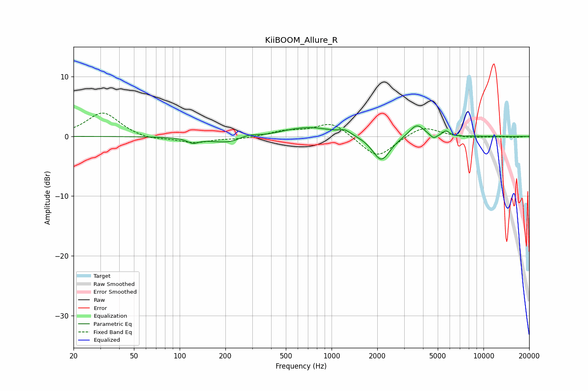

# KiiBOOM_Allure_R
See [usage instructions](https://github.com/jaakkopasanen/AutoEq#usage) for more options and info.

### Parametric EQs
Apply preamp of -1.8 dB when using parametric equalizer.

|   # | Type    |   Fc (Hz) |    Q |   Gain (dB) |
|-----|---------|-----------|------|-------------|
|   1 | Peaking |       122 | 3.89 |        -0.8 |
|   2 | Peaking |       224 | 1.06 |        -1.4 |
|   3 | Peaking |       279 | 2.08 |         1   |
|   4 | Peaking |       517 | 1.39 |         0.3 |
|   5 | Peaking |       735 | 0.92 |         1.5 |
|   6 | Peaking |      1225 | 3.58 |         0.7 |
|   7 | Peaking |      2126 | 2.46 |        -4.2 |
|   8 | Peaking |      3640 | 2.88 |         2.2 |
|   9 | Peaking |      4692 | 5.95 |        -0.8 |
|  10 | Peaking |      5650 | 6    |         0.9 |

### Fixed Band EQs
When using fixed band (also called graphic) equalizer, apply preamp of **-4.0 dB** (if available) and set gains manually with these parameters.

|   # | Type    |   Fc (Hz) |    Q |   Gain (dB) |
|-----|---------|-----------|------|-------------|
|   1 | Peaking |        31 | 1.41 |         4.1 |
|   2 | Peaking |        62 | 1.41 |        -0.6 |
|   3 | Peaking |       125 | 1.41 |        -1   |
|   4 | Peaking |       250 | 1.41 |        -0.4 |
|   5 | Peaking |       500 | 1.41 |         0.8 |
|   6 | Peaking |      1000 | 1.41 |         2.4 |
|   7 | Peaking |      2000 | 1.41 |        -3.7 |
|   8 | Peaking |      4000 | 1.41 |         1.9 |
|   9 | Peaking |      8000 | 1.41 |        -0.3 |
|  10 | Peaking |     16000 | 1.41 |        -0.1 |

### Graphs

