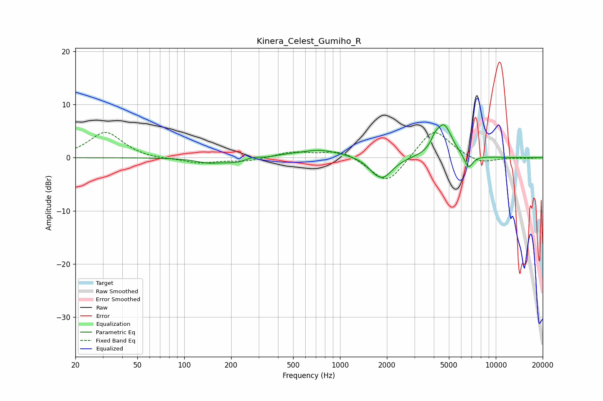

# Kinera_Celest_Gumiho_R
See [usage instructions](https://github.com/jaakkopasanen/AutoEq#usage) for more options and info.

### Parametric EQs
Apply preamp of -6.3 dB when using parametric equalizer.

|   # | Type    |   Fc (Hz) |    Q |   Gain (dB) |
|-----|---------|-----------|------|-------------|
|   1 | Peaking |       140 | 2    |        -0.6 |
|   2 | Peaking |       240 | 1.15 |        -1.4 |
|   3 | Peaking |       273 | 2.53 |         1   |
|   4 | Peaking |       418 | 1.81 |         0.3 |
|   5 | Peaking |       743 | 0.99 |         1.6 |
|   6 | Peaking |      1616 | 4.13 |        -0.6 |
|   7 | Peaking |      1877 | 2.23 |        -3.9 |
|   8 | Peaking |      4077 | 5.64 |         1.4 |
|   9 | Peaking |      4653 | 2.71 |         6.1 |
|  10 | Peaking |      6689 | 4.8  |        -2.7 |

### Fixed Band EQs
When using fixed band (also called graphic) equalizer, apply preamp of **-4.8 dB** (if available) and set gains manually with these parameters.

|   # | Type    |   Fc (Hz) |    Q |   Gain (dB) |
|-----|---------|-----------|------|-------------|
|   1 | Peaking |        31 | 1.41 |         4.8 |
|   2 | Peaking |        62 | 1.41 |        -0.3 |
|   3 | Peaking |       125 | 1.41 |        -1   |
|   4 | Peaking |       250 | 1.41 |        -0.7 |
|   5 | Peaking |       500 | 1.41 |         1.1 |
|   6 | Peaking |      1000 | 1.41 |         1.5 |
|   7 | Peaking |      2000 | 1.41 |        -5.2 |
|   8 | Peaking |      4000 | 1.41 |         5.7 |
|   9 | Peaking |      8000 | 1.41 |        -1.3 |
|  10 | Peaking |     16000 | 1.41 |        -0.1 |

### Graphs

