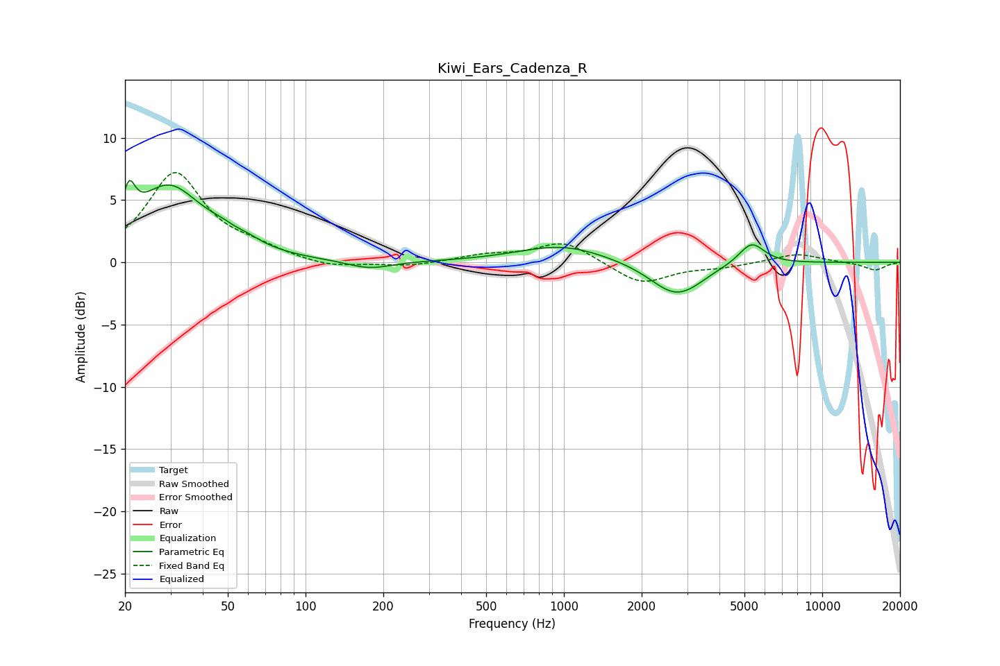

# Kiwi_Ears_Cadenza_R
See [usage instructions](https://github.com/jaakkopasanen/AutoEq#usage) for more options and info.

### Parametric EQs
Apply preamp of -6.7 dB when using parametric equalizer.

|   # | Type    |   Fc (Hz) |    Q |   Gain (dB) |
|-----|---------|-----------|------|-------------|
|   1 | Peaking |        21 | 5.99 |         2.9 |
|   2 | Peaking |        29 | 1.09 |         5.9 |
|   3 | Peaking |        48 | 5.78 |        -0   |
|   4 | Peaking |        52 | 1.99 |         1.5 |
|   5 | Peaking |        53 | 3.36 |        -0.6 |
|   6 | Peaking |       177 | 1.66 |        -0.7 |
|   7 | Peaking |       987 | 0.83 |         1.4 |
|   8 | Peaking |      2698 | 1.43 |        -2.6 |
|   9 | Peaking |      3179 | 2.53 |        -0.2 |
|  10 | Peaking |      5327 | 2.77 |         1.8 |

### Fixed Band EQs
When using fixed band (also called graphic) equalizer, apply preamp of **-7.3 dB** (if available) and set gains manually with these parameters.

|   # | Type    |   Fc (Hz) |    Q |   Gain (dB) |
|-----|---------|-----------|------|-------------|
|   1 | Peaking |        31 | 1.41 |         7.1 |
|   2 | Peaking |        62 | 1.41 |         0.8 |
|   3 | Peaking |       125 | 1.41 |        -0.5 |
|   4 | Peaking |       250 | 1.41 |        -0.3 |
|   5 | Peaking |       500 | 1.41 |         0.5 |
|   6 | Peaking |      1000 | 1.41 |         1.7 |
|   7 | Peaking |      2000 | 1.41 |        -1.8 |
|   8 | Peaking |      4000 | 1.41 |        -0.3 |
|   9 | Peaking |      8000 | 1.41 |         0.7 |
|  10 | Peaking |     16000 | 1.41 |        -0.6 |

### Graphs

