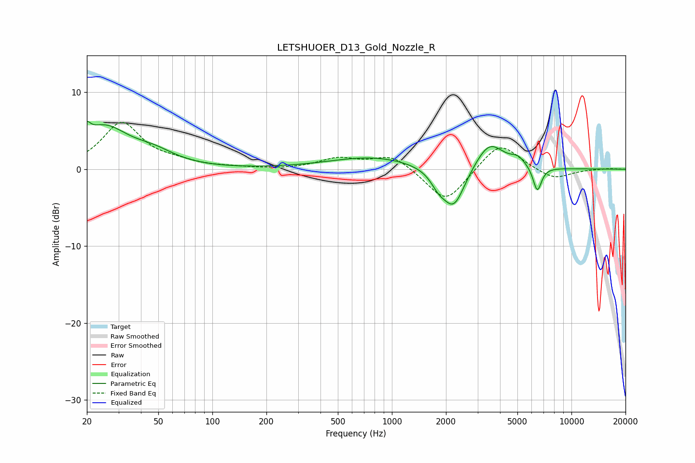

# LETSHUOER_D13_Gold_Nozzle_R
See [usage instructions](https://github.com/jaakkopasanen/AutoEq#usage) for more options and info.

### Parametric EQs
Apply preamp of -6.3 dB when using parametric equalizer.

|   # | Type    |   Fc (Hz) |    Q |   Gain (dB) |
|-----|---------|-----------|------|-------------|
|   1 | Peaking |        20 | 5.99 |         5.5 |
|   2 | Peaking |        20 | 5.83 |        -3.8 |
|   3 | Peaking |        25 | 1.04 |         5.2 |
|   4 | Peaking |        47 | 1.18 |         1.5 |
|   5 | Peaking |       782 | 0.59 |         1.6 |
|   6 | Peaking |      1812 | 3.42 |        -1.4 |
|   7 | Peaking |      2209 | 2.21 |        -5.4 |
|   8 | Peaking |      3493 | 1.78 |         3.6 |
|   9 | Peaking |      5041 | 3.45 |         1   |
|  10 | Peaking |      6454 | 5.8  |        -3.3 |

### Fixed Band EQs
When using fixed band (also called graphic) equalizer, apply preamp of **-6.2 dB** (if available) and set gains manually with these parameters.

|   # | Type    |   Fc (Hz) |    Q |   Gain (dB) |
|-----|---------|-----------|------|-------------|
|   1 | Peaking |        31 | 1.41 |         5.9 |
|   2 | Peaking |        62 | 1.41 |         0.7 |
|   3 | Peaking |       125 | 1.41 |         0.1 |
|   4 | Peaking |       250 | 1.41 |        -0.1 |
|   5 | Peaking |       500 | 1.41 |         1.3 |
|   6 | Peaking |      1000 | 1.41 |         1.9 |
|   7 | Peaking |      2000 | 1.41 |        -4.5 |
|   8 | Peaking |      4000 | 1.41 |         3.7 |
|   9 | Peaking |      8000 | 1.41 |        -1.4 |
|  10 | Peaking |     16000 | 1.41 |         0.1 |

### Graphs

