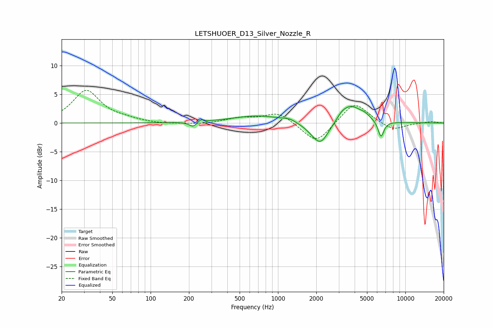

# LETSHUOER_D13_Silver_Nozzle_R
See [usage instructions](https://github.com/jaakkopasanen/AutoEq#usage) for more options and info.

### Parametric EQs
Apply preamp of -3.0 dB when using parametric equalizer.

|   # | Type    |   Fc (Hz) |    Q |   Gain (dB) |
|-----|---------|-----------|------|-------------|
|   1 | Peaking |       216 | 4.67 |        -0.9 |
|   2 | Peaking |       248 | 6    |         0.6 |
|   3 | Peaking |       700 | 0.71 |         1.3 |
|   4 | Peaking |      1228 | 2.98 |         0.4 |
|   5 | Peaking |      1859 | 1.96 |        -0.6 |
|   6 | Peaking |      2164 | 2.24 |        -3.6 |
|   7 | Peaking |      3156 | 3.94 |         0.6 |
|   8 | Peaking |      3704 | 1.86 |         2.9 |
|   9 | Peaking |      4778 | 2.92 |         0.8 |
|  10 | Peaking |      6438 | 6    |        -2.8 |

### Fixed Band EQs
When using fixed band (also called graphic) equalizer, apply preamp of **-5.8 dB** (if available) and set gains manually with these parameters.

|   # | Type    |   Fc (Hz) |    Q |   Gain (dB) |
|-----|---------|-----------|------|-------------|
|   1 | Peaking |        31 | 1.41 |         5.6 |
|   2 | Peaking |        62 | 1.41 |         0.4 |
|   3 | Peaking |       125 | 1.41 |        -0.2 |
|   4 | Peaking |       250 | 1.41 |        -0.3 |
|   5 | Peaking |       500 | 1.41 |         0.8 |
|   6 | Peaking |      1000 | 1.41 |         1.9 |
|   7 | Peaking |      2000 | 1.41 |        -3.7 |
|   8 | Peaking |      4000 | 1.41 |         3.8 |
|   9 | Peaking |      8000 | 1.41 |        -1.4 |
|  10 | Peaking |     16000 | 1.41 |         0.3 |

### Graphs

