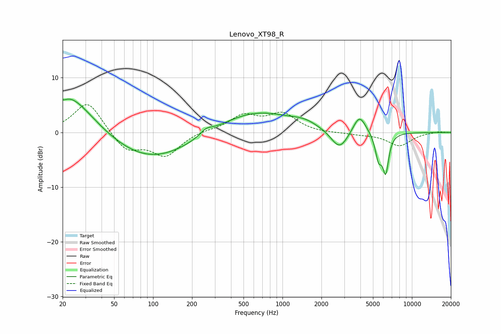

# Lenovo_XT98_R
See [usage instructions](https://github.com/jaakkopasanen/AutoEq#usage) for more options and info.

### Parametric EQs
Apply preamp of -6.2 dB when using parametric equalizer.

|   # | Type    |   Fc (Hz) |    Q |   Gain (dB) |
|-----|---------|-----------|------|-------------|
|   1 | Peaking |        20 | 5.73 |        -0.5 |
|   2 | Peaking |        22 | 0.72 |         7.7 |
|   3 | Peaking |        94 | 0.43 |        -5.3 |
|   4 | Peaking |       257 | 3.13 |         1   |
|   5 | Peaking |       605 | 0.47 |         4   |
|   6 | Peaking |      1487 | 1.53 |         0.8 |
|   7 | Peaking |      2757 | 2.12 |        -3.7 |
|   8 | Peaking |      3931 | 2.87 |         3.5 |
|   9 | Peaking |      5524 | 5.28 |        -4.5 |
|  10 | Peaking |      6273 | 6    |        -6.6 |

### Fixed Band EQs
When using fixed band (also called graphic) equalizer, apply preamp of **-5.2 dB** (if available) and set gains manually with these parameters.

|   # | Type    |   Fc (Hz) |    Q |   Gain (dB) |
|-----|---------|-----------|------|-------------|
|   1 | Peaking |        31 | 1.41 |         5.8 |
|   2 | Peaking |        62 | 1.41 |        -3.4 |
|   3 | Peaking |       125 | 1.41 |        -4.1 |
|   4 | Peaking |       250 | 1.41 |         0.4 |
|   5 | Peaking |       500 | 1.41 |         2.9 |
|   6 | Peaking |      1000 | 1.41 |         3.2 |
|   7 | Peaking |      2000 | 1.41 |        -0.2 |
|   8 | Peaking |      4000 | 1.41 |        -0.3 |
|   9 | Peaking |      8000 | 1.41 |        -2.4 |
|  10 | Peaking |     16000 | 1.41 |         0.2 |

### Graphs

