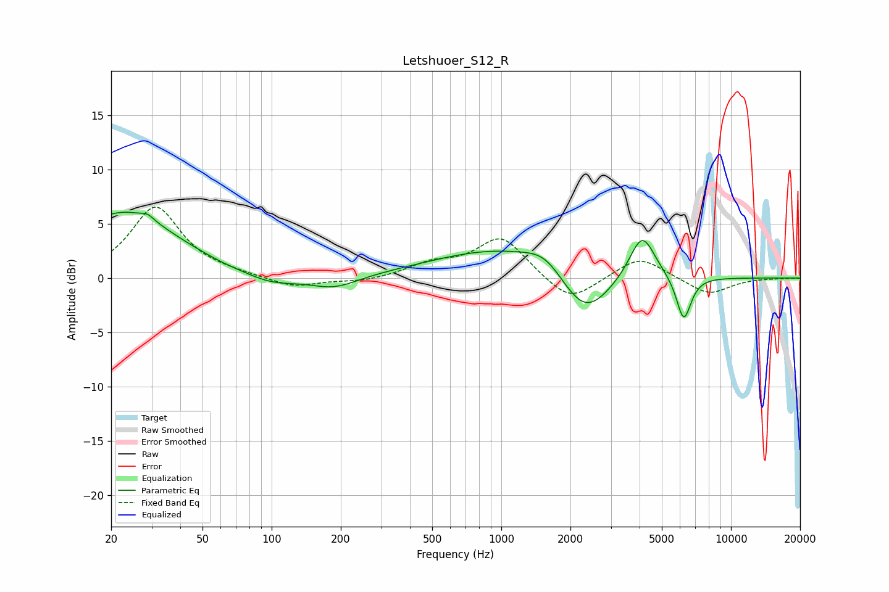

# Letshuoer_S12_R
See [usage instructions](https://github.com/jaakkopasanen/AutoEq#usage) for more options and info.

### Parametric EQs
Apply preamp of -6.2 dB when using parametric equalizer.

|   # | Type    |   Fc (Hz) |    Q |   Gain (dB) |
|-----|---------|-----------|------|-------------|
|   1 | Peaking |        23 | 0.63 |         6   |
|   2 | Peaking |        29 | 5.35 |         0.4 |
|   3 | Peaking |        62 | 2.02 |        -0.1 |
|   4 | Peaking |        99 | 1.21 |        -1   |
|   5 | Peaking |       188 | 1.36 |        -1.1 |
|   6 | Peaking |      1028 | 0.47 |         2.8 |
|   7 | Peaking |      1554 | 1.71 |         1.4 |
|   8 | Peaking |      2306 | 1.25 |        -4.7 |
|   9 | Peaking |      4105 | 2.49 |         4.3 |
|  10 | Peaking |      6228 | 4.29 |        -4.1 |

### Fixed Band EQs
When using fixed band (also called graphic) equalizer, apply preamp of **-6.6 dB** (if available) and set gains manually with these parameters.

|   # | Type    |   Fc (Hz) |    Q |   Gain (dB) |
|-----|---------|-----------|------|-------------|
|   1 | Peaking |        31 | 1.41 |         6.5 |
|   2 | Peaking |        62 | 1.41 |         0.2 |
|   3 | Peaking |       125 | 1.41 |        -0.9 |
|   4 | Peaking |       250 | 1.41 |        -0.4 |
|   5 | Peaking |       500 | 1.41 |         1.2 |
|   6 | Peaking |      1000 | 1.41 |         3.8 |
|   7 | Peaking |      2000 | 1.41 |        -2.4 |
|   8 | Peaking |      4000 | 1.41 |         2.1 |
|   9 | Peaking |      8000 | 1.41 |        -1.6 |
|  10 | Peaking |     16000 | 1.41 |        -0   |

### Graphs

