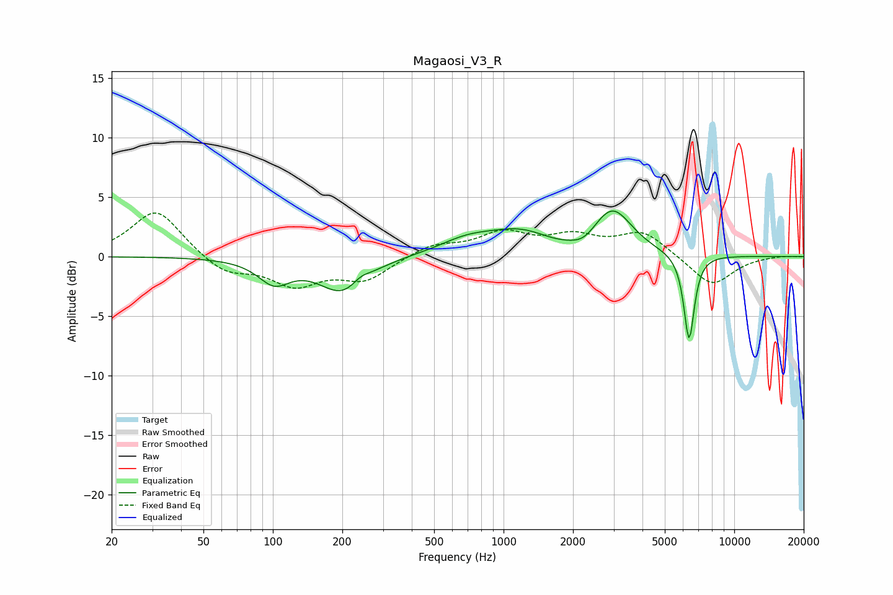

# Magaosi_V3_R
See [usage instructions](https://github.com/jaakkopasanen/AutoEq#usage) for more options and info.

### Parametric EQs
Apply preamp of -3.9 dB when using parametric equalizer.

|   # | Type    |   Fc (Hz) |    Q |   Gain (dB) |
|-----|---------|-----------|------|-------------|
|   1 | Peaking |       101 | 2.06 |        -2   |
|   2 | Peaking |       201 | 1.37 |        -3   |
|   3 | Peaking |       241 | 3.82 |         0.6 |
|   4 | Peaking |       690 | 0.93 |         0.1 |
|   5 | Peaking |       694 | 1.18 |         1   |
|   6 | Peaking |      1218 | 0.95 |         2.2 |
|   7 | Peaking |      1711 | 1    |        -0.8 |
|   8 | Peaking |      2232 | 2.76 |        -0.6 |
|   9 | Peaking |      2961 | 1.65 |         3.9 |
|  10 | Peaking |      6371 | 5.99 |        -7.3 |

### Fixed Band EQs
When using fixed band (also called graphic) equalizer, apply preamp of **-3.8 dB** (if available) and set gains manually with these parameters.

|   # | Type    |   Fc (Hz) |    Q |   Gain (dB) |
|-----|---------|-----------|------|-------------|
|   1 | Peaking |        31 | 1.41 |         4   |
|   2 | Peaking |        62 | 1.41 |        -1.5 |
|   3 | Peaking |       125 | 1.41 |        -2.2 |
|   4 | Peaking |       250 | 1.41 |        -1.9 |
|   5 | Peaking |       500 | 1.41 |         1   |
|   6 | Peaking |      1000 | 1.41 |         1.8 |
|   7 | Peaking |      2000 | 1.41 |         1.5 |
|   8 | Peaking |      4000 | 1.41 |         2   |
|   9 | Peaking |      8000 | 1.41 |        -2.5 |
|  10 | Peaking |     16000 | 1.41 |         0.1 |

### Graphs

