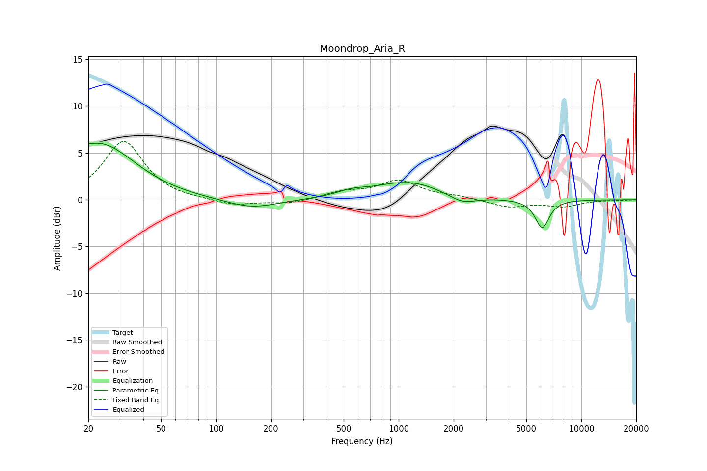

# Moondrop_Aria_R
See [usage instructions](https://github.com/jaakkopasanen/AutoEq#usage) for more options and info.

### Parametric EQs
Apply preamp of -6.1 dB when using parametric equalizer.

|   # | Type    |   Fc (Hz) |    Q |   Gain (dB) |
|-----|---------|-----------|------|-------------|
|   1 | Peaking |        20 | 5.61 |         3.4 |
|   2 | Peaking |        20 | 5.9  |        -2.9 |
|   3 | Peaking |        21 | 1.25 |         1.6 |
|   4 | Peaking |        26 | 0.76 |         4.5 |
|   5 | Peaking |       156 | 1.02 |        -1   |
|   6 | Peaking |       561 | 1.75 |         0.7 |
|   7 | Peaking |       579 | 1.84 |        -0.2 |
|   8 | Peaking |      1130 | 0.77 |         1.9 |
|   9 | Peaking |      2228 | 1.84 |        -0.9 |
|  10 | Peaking |      6105 | 3.6  |        -3   |

### Fixed Band EQs
When using fixed band (also called graphic) equalizer, apply preamp of **-6.3 dB** (if available) and set gains manually with these parameters.

|   # | Type    |   Fc (Hz) |    Q |   Gain (dB) |
|-----|---------|-----------|------|-------------|
|   1 | Peaking |        31 | 1.41 |         6.3 |
|   2 | Peaking |        62 | 1.41 |        -0.1 |
|   3 | Peaking |       125 | 1.41 |        -0.6 |
|   4 | Peaking |       250 | 1.41 |        -0.4 |
|   5 | Peaking |       500 | 1.41 |         0.8 |
|   6 | Peaking |      1000 | 1.41 |         2   |
|   7 | Peaking |      2000 | 1.41 |         0.3 |
|   8 | Peaking |      4000 | 1.41 |        -0.8 |
|   9 | Peaking |      8000 | 1.41 |        -0.7 |
|  10 | Peaking |     16000 | 1.41 |        -0.1 |

### Graphs

