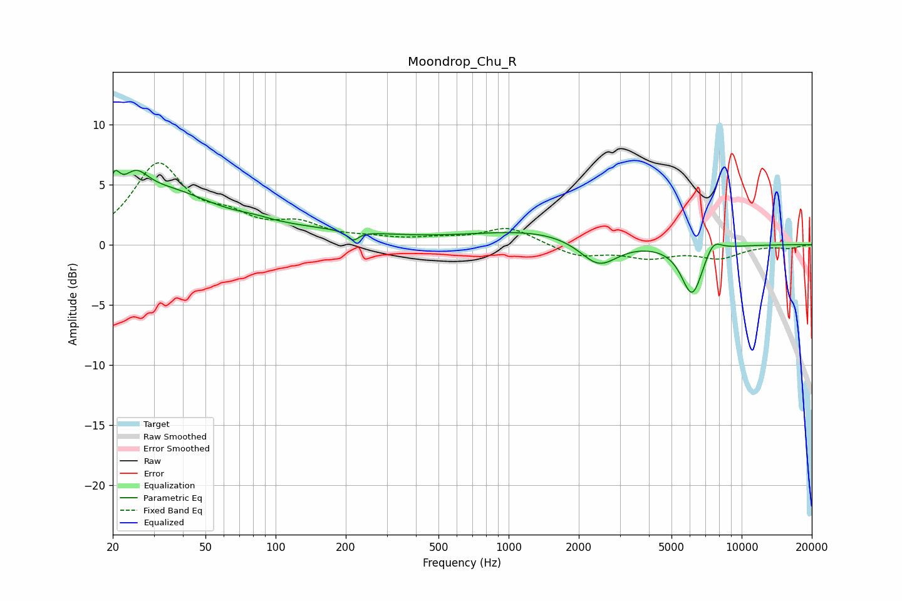

# Moondrop_Chu_R
See [usage instructions](https://github.com/jaakkopasanen/AutoEq#usage) for more options and info.

### Parametric EQs
Apply preamp of -6.3 dB when using parametric equalizer.

|   # | Type    |   Fc (Hz) |    Q |   Gain (dB) |
|-----|---------|-----------|------|-------------|
|   1 | Peaking |        20 | 5.98 |         2.4 |
|   2 | Peaking |        25 | 2.47 |         2.5 |
|   3 | Peaking |        34 | 0.72 |         3.5 |
|   4 | Peaking |        81 | 2.11 |         0.2 |
|   5 | Peaking |       101 | 0.32 |         1.1 |
|   6 | Peaking |       215 | 6    |        -0.8 |
|   7 | Peaking |      1334 | 0.51 |         1.2 |
|   8 | Peaking |      2435 | 1.72 |        -2.3 |
|   9 | Peaking |      6134 | 2.94 |        -4.3 |
|  10 | Peaking |      7534 | 3.68 |         1.2 |

### Fixed Band EQs
When using fixed band (also called graphic) equalizer, apply preamp of **-6.9 dB** (if available) and set gains manually with these parameters.

|   # | Type    |   Fc (Hz) |    Q |   Gain (dB) |
|-----|---------|-----------|------|-------------|
|   1 | Peaking |        31 | 1.41 |         6.4 |
|   2 | Peaking |        62 | 1.41 |         1.7 |
|   3 | Peaking |       125 | 1.41 |         1.5 |
|   4 | Peaking |       250 | 1.41 |         0.4 |
|   5 | Peaking |       500 | 1.41 |         0.4 |
|   6 | Peaking |      1000 | 1.41 |         1.4 |
|   7 | Peaking |      2000 | 1.41 |        -1   |
|   8 | Peaking |      4000 | 1.41 |        -1   |
|   9 | Peaking |      8000 | 1.41 |        -1   |
|  10 | Peaking |     16000 | 1.41 |        -0.3 |

### Graphs

