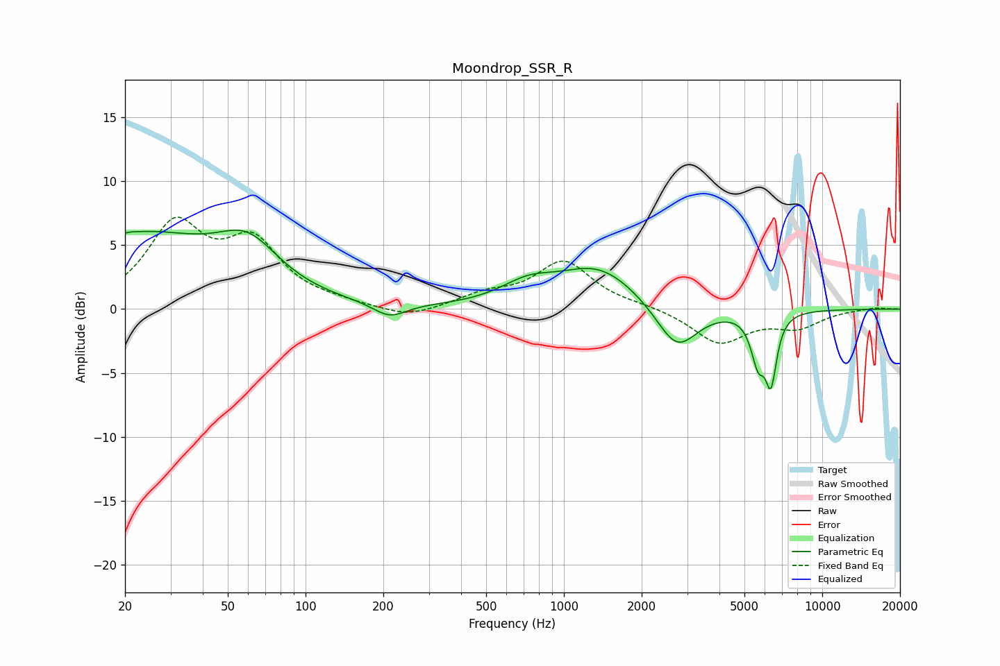

# Moondrop_SSR_R
See [usage instructions](https://github.com/jaakkopasanen/AutoEq#usage) for more options and info.

### Parametric EQs
Apply preamp of -6.3 dB when using parametric equalizer.

|   # | Type    |   Fc (Hz) |    Q |   Gain (dB) |
|-----|---------|-----------|------|-------------|
|   1 | Peaking |        21 | 5.49 |         0.1 |
|   2 | Peaking |        22 | 0.46 |         5.6 |
|   3 | Peaking |        60 | 1.19 |         3.3 |
|   4 | Peaking |       212 | 2.2  |        -1.1 |
|   5 | Peaking |       726 | 1.33 |         1.5 |
|   6 | Peaking |      1363 | 0.91 |         3.2 |
|   7 | Peaking |      2737 | 1.76 |        -3.6 |
|   8 | Peaking |      5673 | 4.73 |        -4.7 |
|   9 | Peaking |      5886 | 3.91 |         1.6 |
|  10 | Peaking |      6325 | 6    |        -5.3 |

### Fixed Band EQs
When using fixed band (also called graphic) equalizer, apply preamp of **-7.3 dB** (if available) and set gains manually with these parameters.

|   # | Type    |   Fc (Hz) |    Q |   Gain (dB) |
|-----|---------|-----------|------|-------------|
|   1 | Peaking |        31 | 1.41 |         6.3 |
|   2 | Peaking |        62 | 1.41 |         4.8 |
|   3 | Peaking |       125 | 1.41 |         0.3 |
|   4 | Peaking |       250 | 1.41 |        -0.8 |
|   5 | Peaking |       500 | 1.41 |         1   |
|   6 | Peaking |      1000 | 1.41 |         3.6 |
|   7 | Peaking |      2000 | 1.41 |         0.2 |
|   8 | Peaking |      4000 | 1.41 |        -2.6 |
|   9 | Peaking |      8000 | 1.41 |        -1.3 |
|  10 | Peaking |     16000 | 1.41 |         0.2 |

### Graphs

