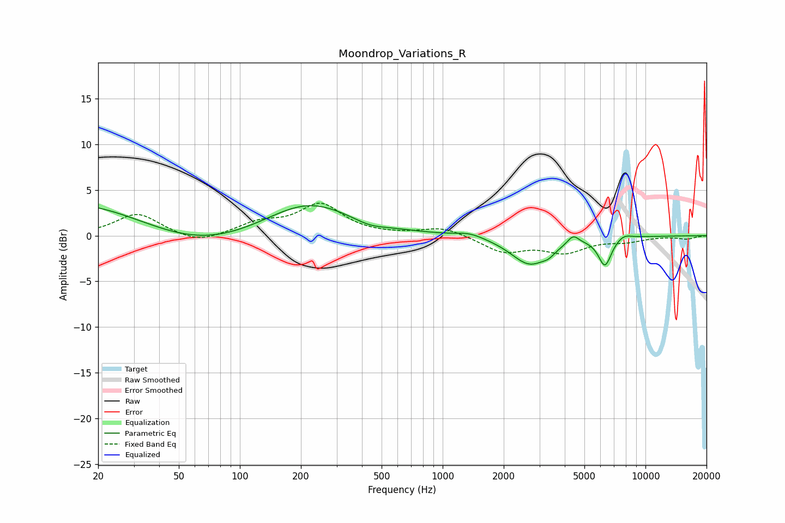

# Moondrop_Variations_R
See [usage instructions](https://github.com/jaakkopasanen/AutoEq#usage) for more options and info.

### Parametric EQs
Apply preamp of -3.4 dB when using parametric equalizer.

|   # | Type    |   Fc (Hz) |    Q |   Gain (dB) |
|-----|---------|-----------|------|-------------|
|   1 | Peaking |        44 | 0.18 |         7   |
|   2 | Peaking |        66 | 0.37 |        -7.2 |
|   3 | Peaking |       219 | 0.73 |         2.6 |
|   4 | Peaking |       435 | 1.78 |        -0.6 |
|   5 | Peaking |      1358 | 2.11 |         0.5 |
|   6 | Peaking |      2692 | 1.51 |        -3.1 |
|   7 | Peaking |      3336 | 4.83 |        -0.5 |
|   8 | Peaking |      4403 | 5.07 |         1   |
|   9 | Peaking |      6312 | 4.2  |        -3.1 |
|  10 | Peaking |      7817 | 3.43 |         0.5 |

### Fixed Band EQs
When using fixed band (also called graphic) equalizer, apply preamp of **-3.7 dB** (if available) and set gains manually with these parameters.

|   # | Type    |   Fc (Hz) |    Q |   Gain (dB) |
|-----|---------|-----------|------|-------------|
|   1 | Peaking |        31 | 1.41 |         2.4 |
|   2 | Peaking |        62 | 1.41 |        -1   |
|   3 | Peaking |       125 | 1.41 |         1.3 |
|   4 | Peaking |       250 | 1.41 |         3.3 |
|   5 | Peaking |       500 | 1.41 |         0   |
|   6 | Peaking |      1000 | 1.41 |         0.9 |
|   7 | Peaking |      2000 | 1.41 |        -1.7 |
|   8 | Peaking |      4000 | 1.41 |        -1.7 |
|   9 | Peaking |      8000 | 1.41 |        -0.5 |
|  10 | Peaking |     16000 | 1.41 |        -0.3 |

### Graphs

