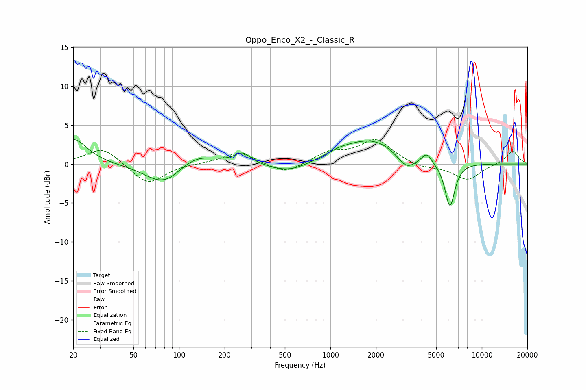

# Oppo_Enco_X2_-_Classic_R
See [usage instructions](https://github.com/jaakkopasanen/AutoEq#usage) for more options and info.

### Parametric EQs
Apply preamp of -3.3 dB when using parametric equalizer.

|   # | Type    |   Fc (Hz) |    Q |   Gain (dB) |
|-----|---------|-----------|------|-------------|
|   1 | Peaking |        20 | 1.57 |         3.3 |
|   2 | Peaking |        80 | 1.13 |        -3   |
|   3 | Peaking |       126 | 1.06 |         1.8 |
|   4 | Peaking |       263 | 2.69 |         1.4 |
|   5 | Peaking |       530 | 1.13 |        -1.2 |
|   6 | Peaking |      1130 | 1.82 |         0.5 |
|   7 | Peaking |      1867 | 0.74 |         3.2 |
|   8 | Peaking |      3172 | 2.26 |        -2   |
|   9 | Peaking |      4326 | 4.52 |         1.3 |
|  10 | Peaking |      6153 | 4.12 |        -5.7 |

### Fixed Band EQs
When using fixed band (also called graphic) equalizer, apply preamp of **-3.2 dB** (if available) and set gains manually with these parameters.

|   # | Type    |   Fc (Hz) |    Q |   Gain (dB) |
|-----|---------|-----------|------|-------------|
|   1 | Peaking |        31 | 1.41 |         2.2 |
|   2 | Peaking |        62 | 1.41 |        -2.7 |
|   3 | Peaking |       125 | 1.41 |         0.1 |
|   4 | Peaking |       250 | 1.41 |         1.5 |
|   5 | Peaking |       500 | 1.41 |        -1.3 |
|   6 | Peaking |      1000 | 1.41 |         1.4 |
|   7 | Peaking |      2000 | 1.41 |         3   |
|   8 | Peaking |      4000 | 1.41 |        -0.5 |
|   9 | Peaking |      8000 | 1.41 |        -2   |
|  10 | Peaking |     16000 | 1.41 |         1.7 |

### Graphs

