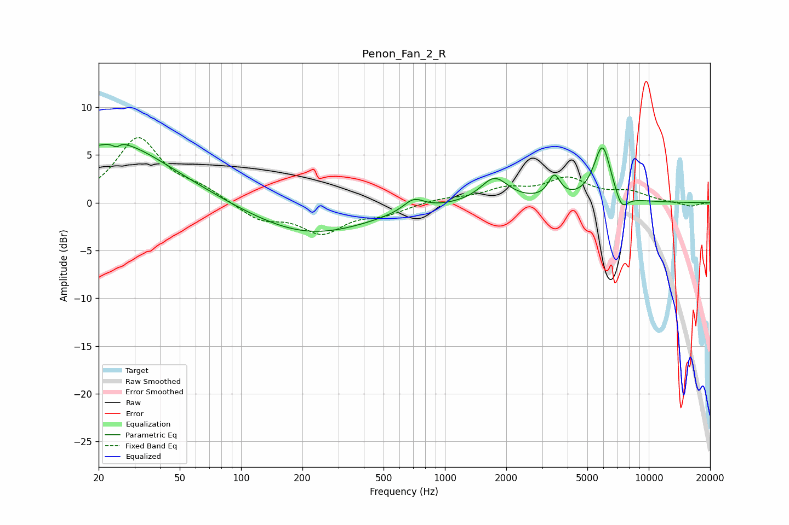

# Penon_Fan_2_R
See [usage instructions](https://github.com/jaakkopasanen/AutoEq#usage) for more options and info.

### Parametric EQs
Apply preamp of -6.2 dB when using parametric equalizer.

|   # | Type    |   Fc (Hz) |    Q |   Gain (dB) |
|-----|---------|-----------|------|-------------|
|   1 | Peaking |        22 | 0.4  |         5.2 |
|   2 | Peaking |        25 | 5.88 |        -3.4 |
|   3 | Peaking |        25 | 5.46 |         3.1 |
|   4 | Peaking |        27 | 0.91 |         1.2 |
|   5 | Peaking |       216 | 0.48 |        -3.4 |
|   6 | Peaking |       702 | 2.81 |         1.3 |
|   7 | Peaking |      1749 | 2.08 |         2.6 |
|   8 | Peaking |      3442 | 4.85 |         2.4 |
|   9 | Peaking |      5930 | 3.23 |         6   |
|  10 | Peaking |      7352 | 4.22 |        -1.8 |

### Fixed Band EQs
When using fixed band (also called graphic) equalizer, apply preamp of **-6.9 dB** (if available) and set gains manually with these parameters.

|   # | Type    |   Fc (Hz) |    Q |   Gain (dB) |
|-----|---------|-----------|------|-------------|
|   1 | Peaking |        31 | 1.41 |         6.7 |
|   2 | Peaking |        62 | 1.41 |         1.2 |
|   3 | Peaking |       125 | 1.41 |        -1.7 |
|   4 | Peaking |       250 | 1.41 |        -3   |
|   5 | Peaking |       500 | 1.41 |        -1   |
|   6 | Peaking |      1000 | 1.41 |         0.4 |
|   7 | Peaking |      2000 | 1.41 |         1.3 |
|   8 | Peaking |      4000 | 1.41 |         2.3 |
|   9 | Peaking |      8000 | 1.41 |         1   |
|  10 | Peaking |     16000 | 1.41 |        -0.4 |

### Graphs

