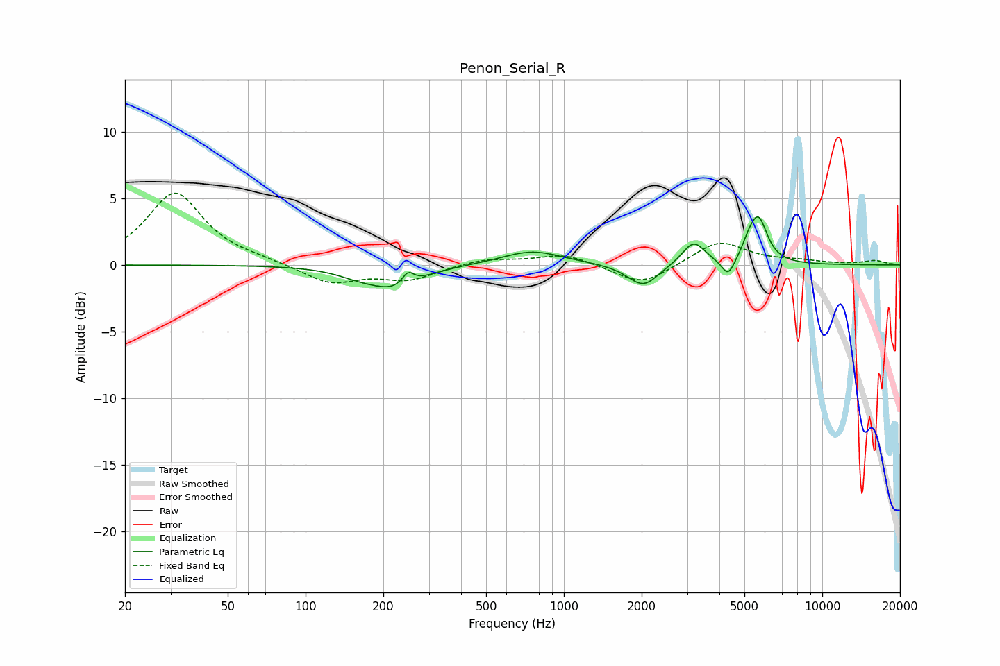

# Penon_Serial_R
See [usage instructions](https://github.com/jaakkopasanen/AutoEq#usage) for more options and info.

### Parametric EQs
Apply preamp of -3.7 dB when using parametric equalizer.

|   # | Type    |   Fc (Hz) |    Q |   Gain (dB) |
|-----|---------|-----------|------|-------------|
|   1 | Peaking |       163 | 1.58 |        -0.5 |
|   2 | Peaking |       225 | 1.47 |        -1.6 |
|   3 | Peaking |       249 | 6    |         1   |
|   4 | Peaking |       753 | 1.21 |         1.1 |
|   5 | Peaking |      1930 | 2.11 |        -0.3 |
|   6 | Peaking |      2040 | 2.47 |        -1.5 |
|   7 | Peaking |      3176 | 3.21 |         1.8 |
|   8 | Peaking |      4323 | 5.52 |        -1.4 |
|   9 | Peaking |      5175 | 6    |         0.7 |
|  10 | Peaking |      5658 | 4.04 |         3.4 |

### Fixed Band EQs
When using fixed band (also called graphic) equalizer, apply preamp of **-5.5 dB** (if available) and set gains manually with these parameters.

|   # | Type    |   Fc (Hz) |    Q |   Gain (dB) |
|-----|---------|-----------|------|-------------|
|   1 | Peaking |        31 | 1.41 |         5.4 |
|   2 | Peaking |        62 | 1.41 |         0.3 |
|   3 | Peaking |       125 | 1.41 |        -1.4 |
|   4 | Peaking |       250 | 1.41 |        -1.1 |
|   5 | Peaking |       500 | 1.41 |         0.5 |
|   6 | Peaking |      1000 | 1.41 |         0.8 |
|   7 | Peaking |      2000 | 1.41 |        -1.6 |
|   8 | Peaking |      4000 | 1.41 |         1.8 |
|   9 | Peaking |      8000 | 1.41 |         0.2 |
|  10 | Peaking |     16000 | 1.41 |         0.3 |

### Graphs

