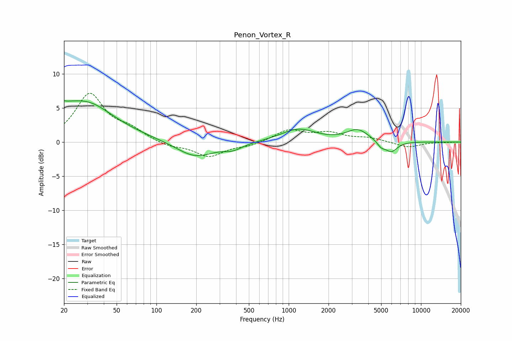

# Penon_Vortex_R
See [usage instructions](https://github.com/jaakkopasanen/AutoEq#usage) for more options and info.

### Parametric EQs
Apply preamp of -6.2 dB when using parametric equalizer.

|   # | Type    |   Fc (Hz) |    Q |   Gain (dB) |
|-----|---------|-----------|------|-------------|
|   1 | Peaking |        20 | 5.74 |         3.2 |
|   2 | Peaking |        20 | 5.9  |        -2.9 |
|   3 | Peaking |        21 | 0.42 |         5   |
|   4 | Peaking |        32 | 0.99 |         1.4 |
|   5 | Peaking |       196 | 1.02 |        -2.3 |
|   6 | Peaking |       378 | 1.93 |        -0.8 |
|   7 | Peaking |      1180 | 1.08 |         1.9 |
|   8 | Peaking |      3320 | 1.71 |         1.7 |
|   9 | Peaking |      5001 | 4.5  |        -0.8 |
|  10 | Peaking |      5968 | 2.98 |        -1.5 |

### Fixed Band EQs
When using fixed band (also called graphic) equalizer, apply preamp of **-7.2 dB** (if available) and set gains manually with these parameters.

|   # | Type    |   Fc (Hz) |    Q |   Gain (dB) |
|-----|---------|-----------|------|-------------|
|   1 | Peaking |        31 | 1.41 |         6.9 |
|   2 | Peaking |        62 | 1.41 |         1.5 |
|   3 | Peaking |       125 | 1.41 |        -0.7 |
|   4 | Peaking |       250 | 1.41 |        -2.1 |
|   5 | Peaking |       500 | 1.41 |        -0.5 |
|   6 | Peaking |      1000 | 1.41 |         1.7 |
|   7 | Peaking |      2000 | 1.41 |         1.2 |
|   8 | Peaking |      4000 | 1.41 |         0.6 |
|   9 | Peaking |      8000 | 1.41 |        -0.8 |
|  10 | Peaking |     16000 | 1.41 |        -0   |

### Graphs

