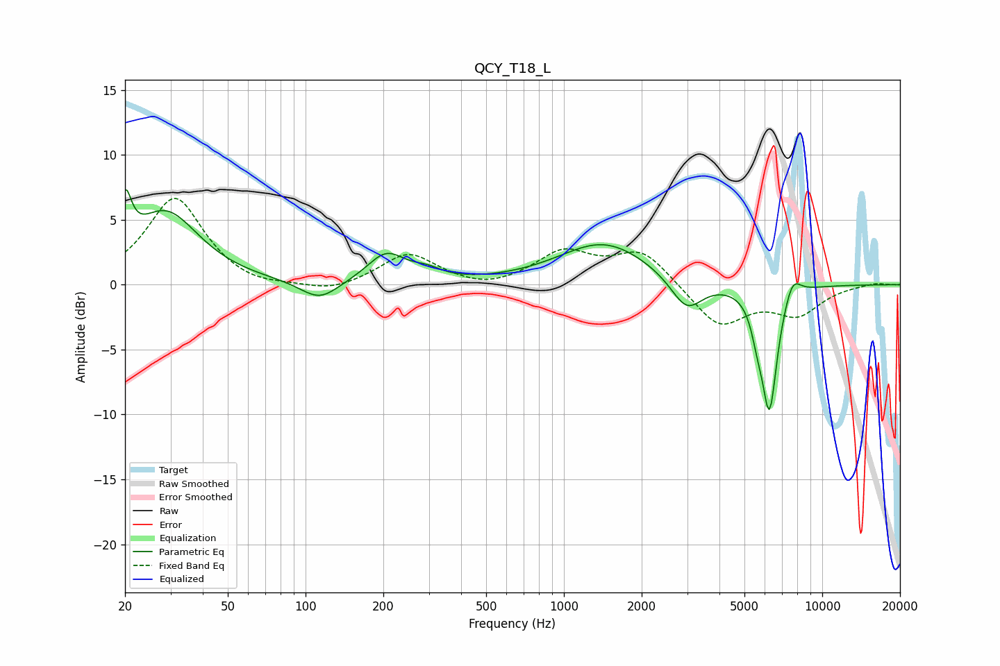

# QCY_T18_L
See [usage instructions](https://github.com/jaakkopasanen/AutoEq#usage) for more options and info.

### Parametric EQs
Apply preamp of -7.4 dB when using parametric equalizer.

|   # | Type    |   Fc (Hz) |    Q |   Gain (dB) |
|-----|---------|-----------|------|-------------|
|   1 | Peaking |        20 | 5.85 |         4   |
|   2 | Peaking |        29 | 1.1  |         5.5 |
|   3 | Peaking |       113 | 1.9  |        -1.5 |
|   4 | Peaking |       206 | 1.91 |         2.3 |
|   5 | Peaking |       295 | 2.51 |         0.6 |
|   6 | Peaking |      1429 | 0.81 |         3.3 |
|   7 | Peaking |      2985 | 2.28 |        -2.6 |
|   8 | Peaking |      5605 | 6    |        -1.6 |
|   9 | Peaking |      6246 | 4.46 |        -9.5 |
|  10 | Peaking |      7671 | 4.25 |         1.6 |

### Fixed Band EQs
When using fixed band (also called graphic) equalizer, apply preamp of **-6.7 dB** (if available) and set gains manually with these parameters.

|   # | Type    |   Fc (Hz) |    Q |   Gain (dB) |
|-----|---------|-----------|------|-------------|
|   1 | Peaking |        31 | 1.41 |         6.7 |
|   2 | Peaking |        62 | 1.41 |        -0.5 |
|   3 | Peaking |       125 | 1.41 |        -0.7 |
|   4 | Peaking |       250 | 1.41 |         2.4 |
|   5 | Peaking |       500 | 1.41 |        -0.5 |
|   6 | Peaking |      1000 | 1.41 |         2.4 |
|   7 | Peaking |      2000 | 1.41 |         2.6 |
|   8 | Peaking |      4000 | 1.41 |        -3.2 |
|   9 | Peaking |      8000 | 1.41 |        -2.1 |
|  10 | Peaking |     16000 | 1.41 |         0.2 |

### Graphs

